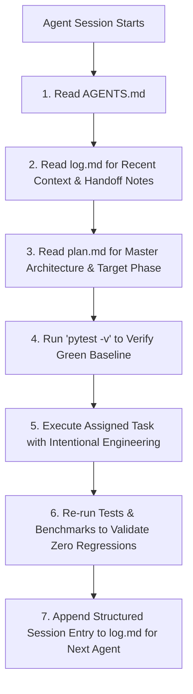

# AGENTS.md — Universal Agent Operating Directives

> **TARGET AUDIENCE:** ALL AI coding assistants (Antigravity, OpenCode, Codex, Claude Code, Cursor, Copilot, etc.) and human contributors working on the **Fisher** codebase.
> **RULE #1:** Read this entire document **and** [`log.md`](file:///d:/projects/fisher/log.md) BEFORE inspecting or modifying any code.

---

## 1. Mandatory Pre-Flight Protocol (Every Session)

Before executing any commands, planning modifications, or writing code, **every agent must execute these steps in order**:



1. **Inspect [`AGENTS.md`](file:///d:/projects/fisher/AGENTS.md) (This File):**
   Understand project constraints, hardware architecture, multi-monitor configuration, and behavioral standards.
2. **Inspect [`log.md`](file:///d:/projects/fisher/log.md):**
   Read the **Agent Execution History & Handoff Log** to see:
   - What the previous agent completed.
   - Exact files created, modified, or deleted.
   - Tests and benchmarks run, along with exact output metrics (jitter, pass rates, catch percentages).
   - Known warnings, edge cases, tech debt, and immediate next steps.
3. **Inspect [`plan.md`](file:///d:/projects/fisher/plan.md):**
   Verify how your task fits into the 5-phase master implementation roadmap and identify the required exit gates.
4. **Establish Green Baseline:**
   Run `pytest -v` in the root directory. If any test fails before you touch code, investigate and document it first.

---

## 2. Multi-Agent Handoff & `log.md` Protocol

Different agents (or separate sessions) will handle different development phases. [`log.md`](file:///d:/projects/fisher/log.md) is the **single source of truth for project memory**.

### Protocol for Every Working Agent:
1. **Never leave an unlogged session:** At the end of your task, you **MUST append a structured entry** to [`log.md`](file:///d:/projects/fisher/log.md) under `## Agent Execution History & Handoff Log`.
2. **Review preceding agent's work:** When starting a phase, review the previous agent's code changes and notes. If you discover bugs, performance regressions, or deviations from [`plan.md`](file:///d:/projects/fisher/plan.md), explicitly document your review findings in your log entry.
3. **Exact command recording:** Record the exact command executed and the tangible benchmark output (e.g., `pytest -v` count/duration, PPO evaluation stats, jitter percentiles). Never say "tests passed" without numbers.

### Required Log Entry Format:
```markdown
### [YYYY-MM-DD] Agent Session: <Agent Name> (<Model Engine>) — <Phase or Task Title>

- **Agent:** <e.g., Antigravity (Gemini 3.8 Flash) | OpenCode (Claude 3.7 Sonnet) | Codex>
- **Target Phase:** <e.g., Phase 2: Capture & Extractor Scaffolding>
- **Session Objective:** <1-2 sentences summarizing what this session aimed to accomplish>

#### 1. Code Changes
| Action | File Path | Rationale & Architectural Impact |
|---|---|---|
| [NEW] | `src/fisher/capture/dxgi_capture.py` | Implemented zero-copy BetterCam DXGI capture loop on Screen 3. |
| [MODIFY] | `configs/default.yaml` | Added default crop bounds for 1080p Stardew fishing bar. |

#### 2. Verification & Benchmarks Run
- `pytest -v`: **XX passed in Y.YYs** (Zero regressions).
- `<specific benchmark command>`:
  - Metric 1: Value
  - Metric 2: Value

#### 3. Exit Gates & Deliverable Status
- [x] Gate requirement 1 (Metric achieved: ...)
- [ ] Gate requirement 2 (Blocked on: ...)

#### 4. Review & Handoff Notes for Next Agent
- **Observations on Preceding Code:** <Critique, verification, or confirmed soundness of prior work>
- **Known Edge Cases / Technical Debt:** <Any caveats, OS-specific quirks, or performance gotchas>
- **Recommended Immediate Next Step:** <Clear, actionable directive for the incoming agent>
```

---

## 3. Hardware & Multi-Screen Topology (Non-Negotiable)

The host system runs a triple-screen physical topology. Code running on this system must respect window and monitor affinity:

| Identifier | Resolution & Scaling | Physical Placement | Dedicated System Role |
|---|---|---|---|
| `\\.\DISPLAY1` | 1536×864 (DPI scaled) | Laptop Display (Left) | **Screen 1:** Dedicated Terminal Telemetry Dashboard (`fisher --dashboard-demo`, Rich live UI). |
| `\\.\DISPLAY5` | 1920×1080 (100% DPI) | Primary External (Center) | **Screen 2:** Code editing, testing, terminals, and agent execution. |
| `\\.\DISPLAY6` | 1920×1080 (100% DPI) | Secondary External (Right) | **Screen 3:** Dedicated game client (*Stardew Valley* borderless window, 100% UI zoom). |

### Multi-Monitor Rules for Code:
- **Zero Hardcoded Coordinates:** Monitor index resolution must use `fisher.utils.display.get_window_monitor_index("Stardew Valley")` via `win32api.MonitorFromWindow`.
- **Coordinate Offsetting:** In-game bounding boxes (e.g., fishing bar ROI `x0: 1520, y0: 220, x1: 1900, y1: 980`) are relative to Screen 3 client bounds.
- **Input Leak Prevention:** Before dispatching keystrokes or mouse clicks, actuators **must** check `win32gui.GetForegroundWindow()` to guarantee inputs only reach *Stardew Valley* and never leak into Screen 1 or Screen 2.

---

## 4. Real-Time Timing & System Constraints

This project controls a real-time game with high sensitivity to latency and jitter:

- **Windows Multimedia Timer:** Default Windows timer quantum is 15.6 ms. You **must** utilize `fisher.utils.timing.HighPrecisionTimer` which calls `winmm.timeBeginPeriod(1)` to enforce 1.0 ms OS timer resolution.
- **Control Frequencies:**
  - Game physics & capture: **60 Hz** ($\Delta t \approx 16.667\text{ ms}$).
  - PPO agent control loop: **30 Hz** ($\Delta t \approx 33.333\text{ ms}$).
- **Jitter Budget:** p99 jitter must remain **$< 1.0\text{ ms}$** (achieved via hybrid OS sleep + `time.perf_counter()` spinlock).
- **Latency Budget:** Total per-tick pipeline latency (Capture $\to$ Extract $\to$ Inference $\to$ Actuate) must remain **$< 10.0\text{ ms}$**.
- **Emergency Killswitch:** The global killswitch is bound to **F9** using `keyboard.is_pressed('f9')` and must terminate actuation within $< 200\text{ ms}$.

---

## 5. Engineering Standards & Code Quality

You are expected to write production-grade code that reflects intentional software architecture:

1. **No "Vibe Coding":**
   - No placeholder functions (`pass`, `# TODO: implement later`).
   - No magic numbers without documented origin (e.g. refer to [references/BobberBar.cs](file:///d:/projects/fisher/references/BobberBar.cs) for decompiled constants).
   - No mock tests that assert trivial truths. Tests must exercise edge cases, invariants, and failure modes.
2. **Configuration Single Source of Truth:**
   - All runtime hyperparameters, thresholds, and dimensions live in [`configs/default.yaml`](file:///d:/projects/fisher/configs/default.yaml).
   - Access configuration strictly through typed loader: `fisher.config.load_config()`.
3. **Type Safety & Defensive Validation:**
   - Use Python 3.11 type hints (`int`, `float`, `list[str]`, `dict[str, Any]`, `np.ndarray`).
   - Validate array shapes, null pointers, and coordinate clamps at API boundaries.
4. **Preserve Documentation Integrity:**
   - Do not wipe existing comments, citations, or decompiled C# line references unless specifically refactoring that component.

---

## 6. Standard CLI Commands & Verification Suite

All agents can run the following CLI commands from the project root:

| Command | Purpose | Expected Benchmark / Status |
|---|---|---|
| `pytest -v` | Complete automated unit test suite. | **26+ passed**, zero regressions. |
| `fisher --check-monitors` | Validate 3-screen display enumeration and game window binding. | Shows `DISPLAY1`, `DISPLAY5`, `DISPLAY6`. |
| `fisher --jitter-test` | Windows 1 ms timer scheduler benchmark (300 ticks). | **p50 $< 0.05\text{ ms}$, p99 $< 0.5\text{ ms}$**. |
| `fisher --dry-run` | End-to-end 300-tick mock pipeline simulation. | 300 ticks, 0 dropped frames, latency $< 1\text{ ms}$. |
| `fisher --eval-sim` | Evaluate trained PPO policy against nominal benchmark suite. | Overall catch rate **$\ge 80\%$**, Easy/Mid **$\ge 95\%$**. |
| `fisher --train-sim` | Train PPO agent in 1D simulator with dynamic curriculum. | Throughput $\approx 6,000-9,000\text{ steps/s}$. |
| `fisher --dashboard-demo` | Interactive Rich terminal telemetry console on Screen 1. | Live renders metrics, loss, and event log. |

---

## 7. Project Directory Structure Quick Reference

```
fisher/
├── AGENTS.md                  # Universal agent directive (THIS FILE)
├── CLAUDE.md                  # Pointer for Claude Code agents
├── .cursorrules               # Pointer for Cursor IDE agents
├── log.md                     # Persistent execution log & agent handoff history
├── plan.md                    # Master technical design and 5-phase roadmap
├── pyproject.toml             # Build system & dependencies (pip install -e .)
├── configs/                   # Single source of truth configs
│   ├── default.yaml           # Master defaults (game, control, sim, ppo, ui)
│   ├── capture_1080p.yaml     # Screen 3 1080p capture overrides
│   └── ppo.yaml               # PPO hyperparameter tuning
├── references/                # Ground truth decompiled C# source
│   └── BobberBar.cs           # Stardew Valley 1.6 decompiled minigame logic
├── src/fisher/                # Core Python package
│   ├── agent/                 # RL policies & baseline controllers
│   ├── capture/               # BetterCam DXGI capture drivers & mock frames
│   ├── env/                   # Gymnasium environment & reward functions
│   ├── extraction/            # OpenCV visual feature extractors
│   ├── input/                 # DirectInput mouse actuators & mock drivers
│   ├── sim/                   # 1D physics simulator & fish kinematic models
│   ├── ui/                    # Rich terminal telemetry console
│   └── utils/                 # High-precision timer, display enumeration
├── tests/                     # Comprehensive pytest test suite
└── models/                    # Serialized model checkpoints & VecNormalize stats
```
