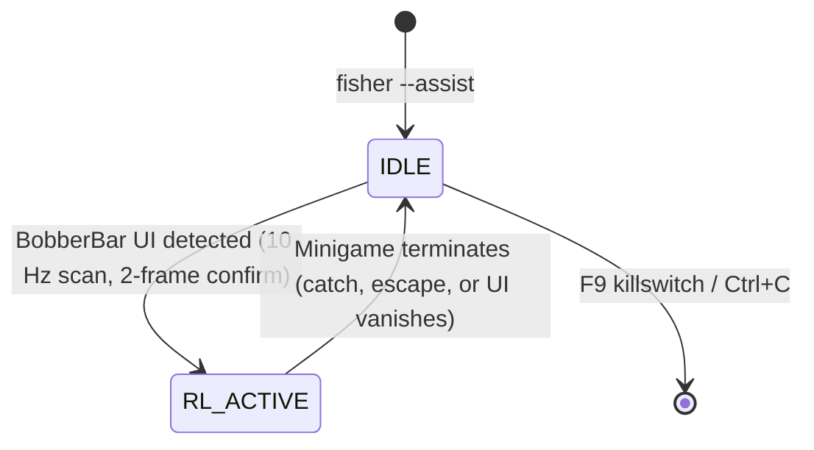

# Phase 4 — On-Demand Fishing Assistant (Revised Direction)

> **HISTORICAL NOTE:** The original Phase 4 plan called for an unattended 30-minute autonomous bot (auto-casting, bite detection, dialog dismissal, stamina eating, night-cycle cutoff). That was pivoted per user request: the user wants to play Stardew Valley manually (farming, exploring, talking to NPCs), but have the AI automatically take over mouse control *only* during the BobberBar minigame (~5–20s) when fishing 1–2 times a day, then release control immediately.
> 
> The autonomous soak-test bot remains preserved as a potential future feature (Phase 5: Autopilot Mode).

---

## Architecture: Two-State On-Demand Watcher



### Components

| Component | File Path | Role |
|---|---|---|
| Package Init | [`src/fisher/orchestration/__init__.py`](file:///d:/projects/fisher/src/fisher/orchestration/__init__.py) | Exposes orchestration package. |
| Safety Supervisor | [`src/fisher/orchestration/safety.py`](file:///d:/projects/fisher/src/fisher/orchestration/safety.py) | Background F9 killswitch thread, Ctrl+F9 hard abort, foreground focus monitor. |
| Fishing Assistant | [`src/fisher/orchestration/assistant.py`](file:///d:/projects/fisher/src/fisher/orchestration/assistant.py) | Lightweight watcher: scans at 10 Hz in IDLE, takes over at 30 Hz in RL_ACTIVE via `LiveFishingEnv`, releases mouse cleanly on any exit. |
| Configuration | [`configs/default.yaml`](file:///d:/projects/fisher/configs/default.yaml) | `assistant:` section specifying scan rate, confirmation frames, transition delay, notifications. |
| CLI Command | [`src/fisher/cli.py`](file:///d:/projects/fisher/src/fisher/cli.py) | `fisher --assist` with `--preview`, `--mock`, `--policy-path`. |
| Automated Tests | [`tests/test_assistant.py`](file:///d:/projects/fisher/tests/test_assistant.py) | 7 unit tests verifying scan, debounce, handoff, mouse release, killswitch, focus loss, and multi-episode sessions. |

---

## Status & Deliverables

- **Test Suite:** `pytest -v` — **69 passed** (62 existing + 7 new), 0 failures, 2 warnings.
- **CLI Commands:**
  - `fisher --assist`: Start live background assistant.
  - `fisher --assist --preview`: Assistant with real-time OpenCV detection overlay.
  - `fisher --assist --mock`: Headless dry run for validation.
- **Safety Guarantee:** Actuator mouse LMB is unconditionally released on every exit from RL_ACTIVE.

---

## How to Run During Gameplay

1. **Launch Game:** Run *Stardew Valley* in Borderless Windowed (1920×1080, 100% UI zoom) on Screen 3 (`\\.\DISPLAY6`).
2. **Start Assistant in Administrator Terminal:**
   ```powershell
   fisher --assist
   # Or with OpenCV visual tracking HUD:
   fisher --assist --preview
   ```
3. **Play:** Cast your rod and hook on bite ("!"). The AI automatically takes over mouse actuation during the BobberBar minigame and hands control back as soon as the fish is reeled in.
4. **Emergency Stop:** Press `F9` anytime to immediately release the mouse.

