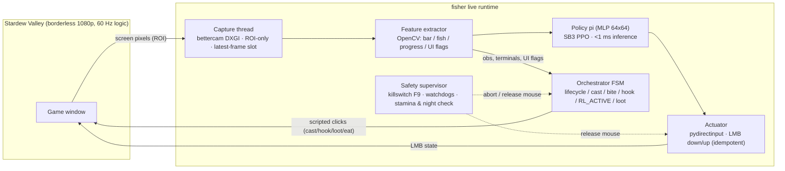
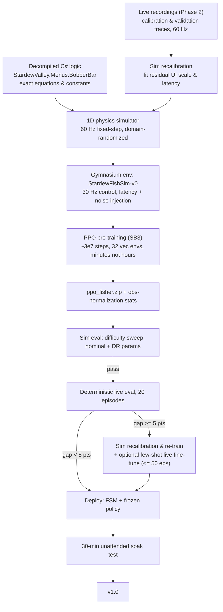
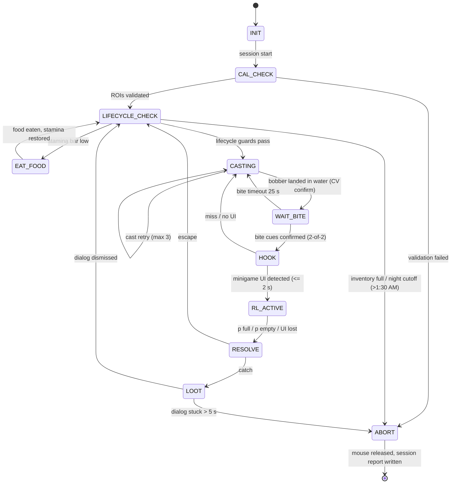

# Fisher — Autonomous RL Agent for the Stardew Valley Fishing Minigame

| | |
|---|---|
| **Status** | v1.0 — planning (source of truth for implementation) |
| **Platform** | Windows 10/11, Python 3.11 |
| **Game** | Stardew Valley 1.6.x, vanilla, single-player, borderless-windowed 1920×1080, UI zoom 100% |
| **Primary stack** | Gymnasium · Stable-Baselines3 (PPO) · bettercam · OpenCV · pydirectinput · pywin32 |
| **Render note** | View in a Markdown viewer with Mermaid + LaTeX math support (GitHub / VS Code) |

---

## 0. Executive Summary

Build an end-to-end RL agent that plays the Stardew Valley fishing minigame autonomously on Windows: **cast → detect bite → hook → play the minigame with a neural policy driving the mouse button → collect loot → repeat**, under a hard killswitch and multiple watchdogs.

The central engineering bet is **sim-to-real**: training strictly inside the live game is ~100× too slow (bite waits, cast overhead, dialogue dismissal, in-game stamina depletion, and the 2:00 AM night cycle dominate wall-clock). Instead we ground a domain-randomized 1D physics simulator directly in the decompiled game logic (`StardewValley.Menus.BobberBar`), pre-train PPO there in minutes, then transfer to the live client through a measured, gated pipeline (deterministic live eval → offline sim recalibration / optional few-shot live fine-tune → deploy).

**Success criteria (project level):**
1. Live catch rate ≥ 85% on fish difficulty ≤ 70, ≥ bang-bang scripted baseline + 10 pts on difficulty > 70.
2. 30-minute unattended soak test: ≥ 20 consecutive successful episodes, zero unrecovered hangs, automated stamina management.
3. Killswitch abort (mouse released, loop stopped) in < 200 ms.
4. Live perception→action latency p99 < 25 ms at a 30 Hz control rate, with Windows timer jitter < 2 ms.

---

## 1. Goals, Non-Goals, Constraints

**Goals**
- Fully autonomous fishing loop on the live Windows client, vanilla game (no mods in production).
- Policy trained with RL (not a hand-tuned script), controlling the green bobber bar via simulated LMB hold/release.
- Sim-first training: ≥ 99% of gradient steps happen in simulation grounded in game source code.
- Production-grade operation: calibration validation, lifecycle watchdogs (stamina, night cycle, inventory), killswitch, session reports.

**Non-goals**
- No multiplayer or anti-cheat circumvention (single-player game only; no online interactions).
- No SMAPI mods in the deployed path (a dev-only telemetry mod is optional, off by default, Phase 2 accelerator).
- No support for non-Windows platforms, other minigames, or non-1080p layouts in v1.
- No vision-from-pixels policy (CNN) in v1 — feature-based observation is primary; visual policy is a stretch goal.

**Constraints**
- Game logic runs at a fixed 60 Hz; capture/control must respect this clock.
- The minigame responds to LMB *state* (down/up), not cursor position — input surface is binary.
- Game window must stay foregrounded (focus loss pauses/corrupts timing → watchdog, not assumption).
- Game execution privilege level: Windows UIPI requires agent to run with equal or higher integrity level (Administrator if game is run elevated).
- In-game constraints: stamina depletes per cast; days terminate at 2:00 AM; inventory has limited slots.

---

## 2. System Architecture

### 2.1 Live runtime data path



### 2.2 Training & transfer pipeline



### 2.3 Tech stack

| Layer | Choice | Rationale / notes |
|---|---|---|
| Env API | `gymnasium.Env` | SB3 ≥ 2.3 requires Gymnasium; `check_env` for contract tests |
| RL framework | **Stable-Baselines3 (PPO)** | Batteries-included, VecNormalize, checkpointing; CleanRL kept as research fork option |
| Screen capture | **bettercam** (DXGI Desktop Duplication), `mss` fallback | Region grab ~240 fps capable; `d3dshot` rejected (unmaintained fork lineage) |
| CV | `opencv-python` (HSV masks, horizontal saliency scan, template match) | Contrast-invariant fish centroid tracking; column scan for progress meter |
| Input | **pydirectinput** (DirectInput scan codes); **Interception driver** as escalation path | Anti-drop vs `pyautogui`; **critical: set `pydirectinput.PAUSE = 0.0`**; verify process admin integrity |
| Window, Display & Timing | `pywin32` (`win32gui`, `win32api`), `winmm.timeBeginPeriod(1)` | High-precision 1 ms timer resolution; dynamic monitor binding (`MonitorFromWindow`), foreground checks, window rect across multi-monitor topology |
| Killswitch | `keyboard` global hotkey (F9), supervisor thread | Works at same integrity level; Ctrl+F9 = hard process abort |
| Logging & Metrics | `tensorboard`, structured JSONL per episode, CSV session summary | Offline analysis of sim2real gap |
| Terminal Dashboard | `rich` (fixed-grid Live layout, panels, tables) | Disciplined, real-time training & session telemetry on dedicated monitor (e.g. laptop display) |
| Config | `pyyaml`, single-file `configs/default.yaml` + overlay files | Every magic number lives in config |
| Tests | `pytest`, mock capture/actuator drivers for CI without hardware | Physics invariants, golden-image CV tests, env contract |

### 2.4 Latency budget (30 Hz control ⇒ 33.3 ms period)

| Stage | p50 target | p99 target | Notes |
|---|---|---|---|
| Capture (ROI ~300×640 px) | 3–8 ms | 12 ms | bettercam region grab, dedicated thread |
| CV extraction | 2–4 ms | 6 ms | masks + horizontal profile / column scan on ROI only |
| Policy inference (MLP 64×64) | 0.3 ms | 1 ms | torch CPU is sufficient; ONNX optional |
| Input dispatch | 1 ms | 2 ms | `mouseDown`/`mouseUp` only when state changes |
| Scheduler jitter | 1–2 ms | 4 ms | Windows default 15.6 ms sleep jitter bypassed via `timeBeginPeriod(1)` + hybrid spinlock |
| **Total** | **~10 ms** | **~22 ms** | measured by `scripts/bench_latency.py`; well within the 33.3 ms tick window |

### 2.5 Decision records (ADR summary)

| # | Decision | Alternatives rejected | Key reason |
|---|---|---|---|
| D1 | **PPO, discrete actions** | DQN, SAC, custom PG | Binary input surface; on-policy robustness to sim mismatch; sample cost irrelevant in sim; see §4.2 |
| D2 | **Feature-based observation (CV→features→MLP)** | Raw frame stack + CNN | ~10³× more sample-efficient; sim needs no renderer; CNN is stretch goal |
| D3 | **Control @ 30 Hz, Discrete(2)** | 20 Hz / Discrete(3) / continuous Δt | 33 ms hold quantum already expresses taps; see §4.2 |
| D4 | **bettercam + pydirectinput + winmm 1 ms** | mss / d3dshot / pyautogui / default sleep | Latency + input-drop resistance + timer precision (< 2 ms jitter); escalation path documented |
| D5 | **Sim-first via decompiled source + domain randomization** | Pure live RL, 5k-episode live fine-tuning | In-game clock (2 AM pass-out), stamina drain, and 25 s cycle make 5,000 live episodes impossible (~35 h); sim grounded in C# logic trains in minutes |
| D6 | **Vanilla game in production, decompiled C# reference** | SMAPI-modded client | Clean deployment; `StardewValley.Menus.BobberBar` provides exact formulas without runtime modding |

---

## 3. Domain Model — The Fishing Minigame

### 3.1 Geometry & coordinates

The minigame UI appears on the right side of the screen when a hooked fish is reeled in: a vertical **track** containing a **fish icon** and the player-controlled **green bobber bar**, plus a thin vertical **progress meter** immediately to its right.

```
   screen (1920x1080)                     minigame ROI (~ 300 x 640 px)
  ┌──────────────────────────────┐       ┌─────────┬──────┐
  │                              │       │ track   │ prog │
  │        game scene            │       │ ┌─────┐ │      │
  │      ~~ water ~~             │  ==>  │ │fish │ │ p=0.7│  ← fill scanned bottom-up
  │                              │       │ │▓▓▓▓▓│ │      │
  │                              │       │ │bar  │ │      │  ← bar covers [b-h, b+h]
  │                              │       │ │▓▓▓▓▓│ │      │
  │                              │       │ └─────┘ │      │
  └──────────────────────────────┘       └─────────┴──────┘
```

**Normalization (all math in this plan):** track height maps to `y ∈ [0, 1]`, **0 = bottom, 1 = top** (screen Y is inverted during extraction). Bar center `b`, fish position `f`, bar half-height `h`, progress `p ∈ [0,1]`.

### 3.2 Game mechanics (grounded in decompiled `StardewValley.Menus.BobberBar`)

- Minigame logic updates at a **fixed 60 Hz**, independent of render FPS. Track height is **568 px**.
- **Bar dynamics & bounce:** Holding LMB applies upward acceleration; releasing lets the bar fall under gravity (`0.25f` px/tick²). **Both bounds bounce with restitution 2/3** (lines 448 & 457 of `BobberBar.cs`). Holding the mouse button while pinned at a boundary zeroes velocity immediately (line 416). Equipping Lead Bobber multiplies bottom restitution by `0.1 × count`.
- **In-bar gravity scaling:** When the fish is inside the bobber bar, gravity drops to **0.6× nominal** (`±0.15f` px/tick²; lines 420–422; drops to 0.3× with Barbless Hook). Sim dynamics must model this state-dependent shift.
- **Velocity damping:** There is **no velocity damping** (`c_d = 1.0`; pure Euler integration: `speed += gravity; pos += speed`).
- **Progress rates are constant:** Catch progress fills at **+0.002 / tick (+0.12 / s)** in-bar and drains at **−0.003 / tick (−0.18 / s)** out-of-bar (lines 512, 562). Fish difficulty $d$ does **not** alter progress rates; it only drives fish kinematics. Initial progress is **$p_0 = 0.3$** ($0.1$ for the player's first-ever fish).
- **Fish kinematics:** First-order velocity chase rather than a 2nd-order spring: `bobberSpeed += (accel − bobberSpeed) / 5.0f`, where `accel = (target − pos) / (random(10, 30) + 100 − d)`. Fish archetypes: `Mixed` (0), `Dart` (1, jumps $\pm(50 \dots 100 + 2d)$ px), `Smooth` (2, retargets at 20× rate: `d * 20 / 4000`), `Sinker` (3, downward bias), `Floater` (4, upward bias).
- **Initial conditions:** Fixed in game constructor (bar starts at bottom $568 - h$, fish at $508$ px, initial target difficulty-dependent).
- **Fish rendering:** The fish icon is a static sprite rect (`614, 1840` in `mouseCursors`, +20 for boss fish); there is no flapping animation. In-bar visual effects are the green bar brightening to full white and $\pm 1$ px `fishShake` jitter. Drawn on top of the bar.
- **Progress meter visual:** The fill is a **red → green gradient** based on $p$. CV must track the fill height / boundary, not a pure green mask.
- **Emergency abort primitive:** Pressing `ESC` during the minigame triggers `emergencyShutDown` (line 641), immediately closing the minigame cleanly without penalty.

### 3.3 Verified parameters (exact from `BobberBar.cs`)

| Symbol | Meaning | Value from `BobberBar.cs` (Track height = 568 px) |
|---|---|---|
| `g_out` | nominal gravity accel | `0.25f` px/tick² = **1.584 track/s²** ($0.25 \times 3600 / 568$) |
| `g_in` | in-bar gravity accel | `0.15f` px/tick² = **0.950 track/s²** ($0.6 \times g_{\text{out}}$) |
| `a_up` | net upward accel holding | `buttonPressed ? -g : +g` (thrust reverses direction) |
| `c_d` | per-tick damping | **1.0** (no damping; pure Euler) |
| `e_b`, `e_t` | restitution at bottom / top | **2/3 (0.667)** at both bounds; zeroed if button held at bound |
| `u`, `w` | progress fill / drain rates | **+0.12 / s** (+0.002/tick) / **−0.18 / s** (−0.003/tick), constant across $d$ |
| `p₀` | initial progress | **0.30** exactly (0.10 for first-ever catch) |
| `v_max` | max velocity cap (free fall) | $\sqrt{2 \cdot 0.25 \cdot 568} \approx 16.85$ px/tick ≈ **1.78 track/s** (normalized `v_max = 2.0`) |
| `motionType` | fish movement profiles | 5 archetypes: `Mixed` (0), `Dart` (1), `Smooth` (2), `Sinker` (3), `Floater` (4) |

---

## 4. MDP Formulation

Episode = one minigame. Control period `Δ = 1/30 s` (agent acts every 2 physics ticks; the simulator runs 60 Hz internally). Discount `γ = 0.999` (effective horizon ≈ 33 s at 30 Hz — spans a full minigame).

### 4.1 Observation space

**Primary: 9-d feature vector** (`Box(low=-1, high=1, shape=(9,))`), built by the CV extractor (live) or the simulator state (training):

| # | Symbol | Meaning | Normalization |
|---|---|---|---|
| 1 | `b` | bar center | 2b − 1 |
| 2 | `v` | bar velocity (finite difference, 1-tick) | v / v_max (v_max ≈ 2.0 track/s) |
| 3 | `f` | fish position (centroid tracker) | 2f − 1 |
| 4 | `ḟ` | fish velocity estimate (EMA over 3 samples) | ḟ / ḟ_max |
| 5 | `h` | bar half-height | 2h − 1 |
| 6 | `p` | progress meter fill | 2p − 1 |
| 7 | `I` | in-bar indicator `1[|f − b| ≤ h]` | {0, 1} |
| 8 | `δ = f − b` | signed fish−bar offset (the core control error) | 2δ |
| 9 | `a_prev` | previous action | {0, 1} |

`a_prev` and `v` mitigate partial observability from action latency (the agent can infer in-flight effects of its last decision).

**Alternative representations (evaluated, not v1):**

| Representation | Pros | Cons | Verdict |
|---|---|---|---|
| **Feature vector (chosen)** | ~10³× sample efficient; sim needs no renderer; robust to reskinning | Requires CV feature extractor | ✅ v1 |
| Raw 84×84×4 frame stack + CNN | No feature engineering | Needs photo-real sim rendering or massive live data; slower inference; worse sim2real | Stretch goal (Phase 5) |
| Hybrid (features + small image crop) | Best of both | Complexity | v2 candidate |

### 4.2 Action space & algorithm choice

**Primary: `Discrete(2)` @ 30 Hz — `{0: RELEASE, 1: HOLD}`.**

The mouse is a binary actuator; at a 33 ms decision quantum, a single HOLD step *is* a tap — taps emerge from alternating actions, with no macro-action timing assumptions to break under latency.

| Option | Assessment |
|---|---|
| **Discrete(2) @ 30 Hz** | ✅ **Chosen.** Minimal, complete, latency-robust; expressible in sim and live identically |
| Discrete(3) with TAP macro (press 4 ticks, auto-release, control resumes after 6 ticks) | Viable ablation for a 20 Hz fallback rate; macro duration is a hand-tuned constant and aliases with latency — keep as experiment, not baseline |
| Continuous hold duration Δt ∈ [0,1] | ❌ Rejected: game input is binary, sub-17 ms resolution is needed for Δt to matter at 60 Hz → control aliasing; adds sim2real timing risk for zero expressive power |

**Algorithm: PPO (Stable-Baselines3).**

| Candidate | Verdict | Reason |
|---|---|---|
| **PPO** | ✅ | Native discrete support; clipped objective tolerates the mild off-policyness induced by observation/action latency; on-policy data collection matches both the cheap sim and the live fine-tune loop; tiny MLP meets the latency budget |
| DQN | ⚠️ | Workable but value-based methods are brittle under non-stationary reward shaping, latency-induced partial observability, and stale replay frames; no advantage over PPO here |
| SAC | ❌ | Designed for continuous torque control; unnecessary complexity for 2 discrete actions |
| CleanRL / custom PG | Optional fork | For research ablations after v1 ships |

### 4.3 Reward function

All quantities are the **same normalized features** in sim and live ⇒ identical reward code path (`fisher.env.rewards`) — a prerequisite for transfer.

**Soft in-bar overlap** (denser signal than the binary indicator):

$$
o_t \;=\; \operatorname{clip}\!\left(1 - \frac{\lvert f_t - b_t \rvert - h_t}{h_t},\; 0,\; 1\right)
$$

(= 1 when the fish is inside the bar; decays linearly to 0 one bar-width away.)

**Potential-based progress shaping** (Ng et al. 1999 — guarantees the optimal policy is unchanged):

$$
\Phi(s_t) = w_p \, p_t, \qquad F_t = \gamma\,\Phi(s_{t+1}) - \Phi(s_t)
$$

**Per-step reward:**

$$
r_t \;=\; \underbrace{w_o\, o_t}_{\text{keep fish in bar}} \;+\; \underbrace{w_p\,(\gamma\, p_{t+1} - p_t)}_{\text{progress shaping}} \;-\; \underbrace{w_v\,\tilde{v}_t^{\,2}}_{\text{oscillation penalty}} \;-\; \underbrace{w_s}_{\text{time cost}} \;+\; \underbrace{R_T}_{\text{terminal}}
$$

with $\tilde{v}_t = v_t / v_{\max}$ (bar velocity, normalized) and

$$
R_T = \begin{cases}
+R_{\text{win}} & p_T \geq 1 \quad (\text{catch}) \\
-R_{\text{lose}} & p_T \leq 0 \quad (\text{escape}) \\
0 & \text{truncated (watchdog / } T_{\max}) \\
\end{cases}
$$

**Default weights (v1; hyperparameter tuning in Phase 1):**

| Param | Value | Param | Value |
|---|---|---|---|
| `w_o` | 0.02 | `w_s` | 0.005 / step |
| `w_p` | 5.0 | `R_win` | +10 |
| `w_v` | 0.002 | `R_lose` | −5 |
| `γ` | 0.999 | `T_max` | 30 s (900 steps) |

**Anti-stall audit (why the agent cannot farm the dense reward forever):** the per-step time cost `w_s` and discounting ensure catching decisively dominates stalling or escaping (derivation in Appendix C). Progress increases whenever the fish is in-bar ($+0.12$ / s), forcing the episode to terminate naturally at $p \ge 1$ within $\le 30$ s.

**Optional v2 terms (off in v1):** treasure bonus (chest collected while fish stays in bar), action-switch penalty `−w_a·1[a_t ≠ a_{t−1}]` if oscillation metrics demand it, "perfect catch" bonus for zero-drain episodes.

### 4.4 Timing, latency & partial observability

- Control period: 2 physics ticks (30 Hz). If live p99 latency > 30 ms ⇒ switch to 3 ticks (20 Hz) — one config flag, retrain sim (minutes).
- **Sim trains with injected latency**: observation delay and action-effect delay each drawn per episode from {1, 2, 3, 4} ticks (lower bound of 1 tick accounts for MonoGame's inherent `oldMouseState` polling delay).
- Actuator is **idempotent**: `HOLD` sends `mouseDown` only if not already down (avoids click-stream spam).

---

## 5. Simulation & Sim-to-Real Strategy

### 5.1 Bar physics (60 Hz explicit Euler, exact port of `BobberBar.cs`)

```python
# Exact dynamics from BobberBar.cs (normalized coordinates [0,1], 0=bottom, 1=top)
# tau = 1/60 s; u in {0, 1} = LMB state; in_bar = (|f - b| <= h)

# 1. State-dependent acceleration: 0.25f px/tick^2 = 1.584 track/s^2
g = G_NOMINAL * (0.6 if in_bar else 1.0)
a = g if u else -g

# 2. Pure Euler velocity update (no damping: c_d = 1.0)
v_next = v + a * tau
b_next = b + v_next * tau

# 3. Boundary collisions: restitution 2/3 at BOTH ends; pinned-button zeroing
if b_next > 1 - h:  # Top bound
    b_next = 1 - h
    v_next = -v_next * (2.0 / 3.0)
    if u:  # Holding LMB while pinned at top stops bar dead
        v_next = 0.0

if b_next < h:      # Bottom bound
    b_next = h
    restitution = (2.0 / 3.0) * (0.1 if lead_bobber else 1.0)
    v_next = -v_next * restitution
    if not u:  # Releasing LMB while pinned at bottom stops bounce
        v_next = 0.0
```

### 5.2 Fish behavior model (exact port of `BobberBar.update()`)

First-order velocity-chase dynamics matching community decompile:

$$
\text{accel} = \frac{\tau_f - f}{\operatorname{random}(10, 30) + 100 - d}, \qquad v_f \leftarrow v_f + \frac{\text{accel} - v_f}{5.0}, \qquad f \leftarrow f + v_f \cdot \tau
$$

- **Retargeting logic by archetype (`motionType`):**
  - `Mixed` (0): periodic retargets at rate proportional to difficulty $d$.
  - `Dart` (1): stationary intervals punctuated by jumps of $\pm (50 \dots 100 + 2d)$ px.
  - `Smooth` (2): retargets at 20× frequency (`d * 20 / 4000` per tick) for fluid wave motion.
  - `Sinker` (3): downward target bias after regime change.
  - `Floater` (4): upward target bias after regime change.
- **Progress integration:**
  $$
  p_{t+1} = \operatorname{clip}(p_t + (0.002 \cdot I_t - 0.003 \cdot (1 - I_t)),\; 0,\; 1)
  $$
  ($+0.12$ / s in-bar, $-0.18$ / s out-of-bar; independent of difficulty; initial $p_0 = 0.30$).

### 5.3 Domain randomization (per-episode draws)

| Parameter | Range | Parameter | Range |
|---|---|---|---|
| `g_out` | ±10% around 1.58 track/s² | obs noise on `b, f` (σ, track units) | 0–0.02 |
| in-bar gravity factor | U[0.55, 0.65] (nominal 0.6) | obs bias on `b, f` | ±0.01 |
| `e_b`, `e_t` | U[0.60, 0.73] (nominal 2/3) | obs delay / action delay | 1–4 ticks each |
| fish difficulty `d` | U[5, 110] (curriculum-controlled) | control period | 2 or 3 ticks |
| behavior type | uniform over 5 types | bar half-height `h` | U[0.08, 0.22] (level & gear) |
| initial state | $b_0 \sim \mathcal{N}(h, 0.02)$, $f_0 \sim \mathcal{N}(0.1, 0.02)$ | initial progress $p₀$ | U[0.25, 0.35] (nominal 0.30) |

Biased observation noise/bias injection is the key robustness trick: it forces the policy to tolerate live calibration error without needing live gradient steps.

### 5.4 Game Source Ground Truth & Empirical Calibration (Phase 1 & 2)

1. **Extract source ground truth:** inspect decompiled `StardewValley.Menus.BobberBar` from `Stardew Valley.dll` using ILSpy/dotPeek. Extract exact numeric constants for bar gravity step (`0.25f`), upward acceleration, damping, bounce restitution, and the exact state equations for the 5 fish archetypes (`Mixed`, `Dart`, `Smooth`, `Sinker`, `Floater`).
2. **Record validation traces:** log 60 Hz tuples `(t, action, b, v_est, f, I, p)` from live minigames (`scripts/record.py`) to verify UI coordinate scaling, input dispatch latency, and real-time capture alignment.
3. **Validate:** open-loop replay of held-out recordings through the C#-grounded simulator — bar-position prediction error < 5% of track width over a 5 s horizon; progress trajectory RMSE < 0.05.
4. *(Optional accelerator, dev-only)*: a SMAPI telemetry mod dumping true `(bar, fish, progress)` state as JSONL to cross-check the CV extractor against game memory. Off by default; never required in production.

### 5.5 Sim training protocol

PPO configuration (`configs/ppo.yaml`):

| Hyperparameter | Value | Hyperparameter | Value |
|---|---|---|---|
| n_envs (vec) | 32 | rollout (n_steps × n_envs) | 16,384 |
| minibatch | 512 | epochs / iter | 10 |
| lr | 3e-4 (linear anneal → 0) | clip range | 0.2 |
| GAE λ | 0.95 | vf coef | 0.5 |
| ent coef | 0.01 → 0.001 (annealed) | net arch | `[64, 64]` tanh |
| total steps | 2–5 × 10⁷ | obs norm | `VecNormalize(norm_obs=True, norm_reward=False)` — rewards are hand-scaled and audited |

Curriculum:
- **Stage A:** `d ≤ 35`, large `h` (≥ 0.18), latency ≤ 2 ticks, no obs noise.
- **Stage B:** `d ≤ 70`, nominal DR.
- **Stage C:** full DR (§5.3) incl. latency up to 4 ticks and obs bias — **the deployment model comes from Stage C**.

Checkpoints evaluated every 2 × 10⁵ steps on a **held-out nominal-parameter suite** (no DR at eval); model selection on eval catch rate, not train return. Budget: ~10–20 min wall-clock for 3 × 10⁷ steps on a modern laptop CPU.

### 5.6 Transfer gates (Phase 3)

1. **Sim eval gate:** catch rate ≥ 95% @ d ≤ 70 and ≥ 80% @ d ≤ 110 on nominal params.
2. **Deterministic live eval:** 20 episodes, frozen policy, no gradient steps → measure `gap = CR_sim − CR_live`.
3. `gap < 5 pts` → deploy. `gap ∈ [5, 20]` → **offline sim recalibration**: log live trajectory mismatches, update residual latency/damping in sim config, re-train PPO in simulation (~15 min); optional few-shot live fine-tune capped at ≤ 50 episodes with automated stamina management. `gap > 20 pts` → stop; debug perception/actuation (do *not* attempt to learn through a broken perception stack).
4. Obs-normalization stats from sim are frozen for live (DR already covers calibration spread).

---

## 6. Live Pipeline Components

### 6.1 Capture (`fisher.capture`)

- Dedicated thread: `bettercam.create(output_idx=0, output_color="BGR")`, `cam.grab(region=ROI)` in a tight loop, publishing into a **single latest-frame slot** (lock-free swap; stale frames dropped, never queued) — prevents backlog-induced latency.
- `mss` driver as a config-selectable fallback (`driver: bettercam|mss`).
- Session start validates that measured capture FPS ≥ 60 and frame timestamps are monotonic.

### 6.2 CV feature extractor (`fisher.vision`)

| Element | Method | Notes |
|---|---|---|
| Minigame UI detection | dark-dimmed panel detector + track aspect-ratio check in right-half ROI | gates FSM `RL_ACTIVE` entry/exit; debounce ~0.35 s fade-out |
| Track bounds | edge/segment analysis of the panel | defines `[0,1]` normalization; calibrated once per session (568 px track) |
| Green bar | HSV green mask → min/max y → center `b`, half-height `h` | largest connected component; sub-pixel via moments |
| Fish icon | horizontal profile scan / color saliency / contrast-invariant template match | robust to background shift (dark track vs bright green bar + sparkles) and static sprite with ±1 px jitter |
| Progress `p` | column scan tracking red→green gradient fill height / luminance edge | robust to non-green color at low progress; normalized `[0,1]` |
| Bite "!" cue | template match in player-head ROI (multi-orientation) + **bobber-dip motion cue** | 2-of-2 confirmation within 300 ms window; optional WASAPI audio peak cue fallback |
| Loot dialog | template match of the catch-dialog / OK button | dismissal target for `RESET_LOOT` |
| Stamina meter | pixel fill check of stamina gauge ROI (bottom-right) | triggers `EAT_FOOD` state when fill falls below 15% |
| In-game clock | template/threshold detector on top-right clock HUD | enforces 1:30 AM night cutoff to avoid 2:00 AM passout penalty |
| Inventory dialog | template match on "Inventory Full" dialog prompt | halts session before wasted casts |

**Calibration (`scripts/calibrate.py`):** one-shot interactive tool — captures a live minigame screenshot, asks the user to confirm 2 anchor points (track top/bottom), auto-derives all ROIs by scale factors from the 1080p reference, writes `configs/capture_1080p.yaml`. A session-start **validation step** re-checks ROI sanity (expected colors present); failure ⇒ abort before any input is sent.

**Golden-image tests:** labeled frames in `data/goldens/` (incl. in-bar, red/green progress gradient, night, rain, and treasure cases); extractor must hit ≥ 99% frame-level accuracy in CI.

### 6.3 Actuator (`fisher.input`)

- `pydirectinput` with **`pydirectinput.PAUSE = 0.0`** (default 100 ms inter-action pause would wreck timing).
- **Process elevation check:** Verify Windows UIPI integrity level on startup (`ctypes.windll.shell32.IsUserAnAdmin()`); if the game runs elevated, the agent must run elevated, otherwise `SendInput` events are dropped silently.
- API: `set_press(bool)` — idempotent; only dispatches `mouseDown`/`mouseUp` on state change; current state tracked in the class.
- Single LMB click helper for cast/hook/loot; RMB helper for eating food.
- **Instant minigame abort helper:** `send_escape()` sends DirectInput scan code for `ESC`, directly calling MonoGame's native `emergencyShutDown` to cleanly close the minigame in < 1 tick without wait or penalty.
- **Timing precision:** `fisher.utils.timing` sets `winmm.timeBeginPeriod(1)` on process startup to enforce 1 ms OS timer granularity, eliminating the default 15.6 ms sleep jitter.
- **Escalation path:** if logs show input drops (press-state mismatch detected via game response), swap to the Interception driver (kernel-level, requires signed-driver install) behind the same `Actuator` interface — no other code changes.

### 6.4 `LiveFishingEnv(gymnasium.Env)` mapping

| Gymnasium concept | Implementation |
|---|---|
| `reset()` | Orchestrator pre-roll: lifecycle check → cast → wait bite → hook → confirm minigame UI → zero timers → return first obs (see §7; env delegates to FSM, does **not** own game control directly) |
| `step(a)` | `set_press(a)` → sleep to next 30 Hz tick (hybrid spinlock) → capture+extract → compute reward (§4.3, same code as sim) → detect terminal |
| `terminated` | `p ≥ 1` (catch) or `p ≤ 0` (escape) or minigame UI vanished |
| `truncated` | watchdog timeout (`T_max`), focus loss, tracker lost > 0.5 s — truncated episodes receive **no** terminal bonus (never reward an abort) |
| `observation_space` | `Box(-1, 1, (9,))` |
| `action_space` | `Discrete(2)` |
| `render()` | overlay debug window (bar/fish tracks, action, reward) — dev mode only |

Live eval uses this env with `n_envs = 1`; every episode is logged as JSONL (obs, actions, rewards, CV diagnostics) for offline analysis and sim recalibration.

---

## 7. Orchestration & Safety

### 7.1 State machine



### 7.2 State table

| State | Entry action | Exit condition | Timeout / failure |
|---|---|---|---|
| `INIT` | load config, policy, warm up capture, `timeBeginPeriod(1)` | checks pass + admin verified | 5 s → ABORT |
| `CAL_CHECK` | run ROI validation on a probe capture | ROIs sane | → ABORT (no input sent) |
| `LIFECYCLE_CHECK` | inspect stamina bar, clock ROI, inventory status | guards nominal → `CASTING` | Stamina low → `EAT_FOOD`; Full/Night → ABORT |
| `EAT_FOOD` | press hotbar slot `food_hotbar_slot` (e.g. key '1'), right-click, dismiss prompt | stamina restored | 3 s → ABORT |
| `CASTING` | select rod slot, press LMB 0.6 s (fixed power), release | bobber sprite in pond ROI | 3 retries → ABORT |
| `WAIT_BITE` | monitor bobber ROI + "!" template | 2-of-2 cue → HOOK | 25 s → recast |
| `HOOK` | single LMB click | minigame UI appears | 2 s → recast |
| `RL_ACTIVE` | **hand control to policy**, 30 Hz env loop | terminal condition from env | `T_max`, watchdogs → truncated episode |
| `RESOLVE` | log outcome | catch → LOOT; escape → LIFECYCLE_CHECK | 3 s → ABORT |
| `LOOT` | click through catch dialog (v1: skip treasure choice) | dialog gone | 5 s → ABORT |
| `ABORT` | release LMB, stop FSM, write report, focus console | — | terminal |

`RL_ACTIVE` inner loop (per 33 ms tick):

```python
obs      = extractor.features(capture.latest())
action   = policy.predict(obs, deterministic=True)
actuator.set_press(bool(action))
terminal = extractor.check_terminal()
```

### 7.3 Safety supervisor (independent thread)

- **Killswitch:** `F9` global hotkey → release LMB → send `ESC` (`emergencyShutDown`) if minigame active → stop FSM → print state → focus console (target < 200 ms). `Ctrl+F9` = hard process exit.
- **Watchdogs (all → ABORT):** game window lost foreground; minigame UI lost > 0.5 s during `RL_ACTIVE`; tracker confidence below threshold for N consecutive frames; capture FPS < 45; extractor exception; cursor physically moved by a human during `RL_ACTIVE` (optional v2, human-takeover detection).
- **Session & lifecycle limits:** 
  - Max episodes (default 100), max wall-clock (default 45 min).
  - **Stamina guard:** pixel-check stamina bar; if below 15%, auto-consume designated food item from hotbar slot.
  - **Night cycle guard:** in-game days end at 2:00 AM causing pass-out; stop session by 1:30 AM (clock ROI template check or episode budget cap ~25 episodes/day).
  - **Inventory guard:** stop if "Inventory Full" dialog appears.
- **Environment hygiene (documented setup, not code):** disable sleep/hibernate, disable Steam overlay (avoid popup steals), Focus Assist off, high-performance power plan, game set to borderless windowed 1920×1080 with UI zoom 100%.
- Every abort writes a structured session report (episode log, latency percentiles, tracking stability, outcome counts).

---

## 8. Implementation Phases & Milestones

> Effort estimates assume one engineer, part-time. `- [ ]` checkboxes are the working task list; update as items complete.

### Phase 0 — Bootstrap & System Precision (0.5 d)
- [x] Repo scaffold per §10, `pyproject.toml` with pinned deps (gymnasium, stable-baselines3 ≥ 2.3, torch, bettercam, opencv-python, pydirectinput, pywin32, keyboard, pyyaml, tensorboard, pytest)
- [x] `fisher.utils.timing`: initialize `winmm.timeBeginPeriod(1)` to lock 1 ms OS timer resolution; elevation check (`IsUserAnAdmin`)
- [x] `configs/default.yaml` schema + loader; structured logger; seed-everything util
- [x] Mock `CaptureDriver` / `Actuator` interfaces so all subsequent phases are CI-testable headless
- **Done when:** `pytest` green with mocked drivers; `python -m fisher --dry-run` executes a fake episode end-to-end with < 2 ms scheduler jitter. [COMPLETED]

### Phase 1 — Simulator & Decompiled C# Ground Truth (2.5 d)
- [x] Decompile `StardewValley.Menus.BobberBar` from `Stardew Valley.dll` (ILSpy/dotPeek); extract exact numeric constants: gravity step (`0.25f`), thrust delta, zero damping, bounce restitution (2/3), bound pinning, in-bar gravity ×0.6, and the 5 fish archetype state equations
- [x] `sim/physics.py` + unit tests (bounce restitution 2/3, bound pinning, in-bar gravity ×0.6, seed determinism)
- [x] `sim/fish.py` behavior models matching decompiled `BobberBar` first-order velocity-chase logic (5 types, difficulty-parameterized)
- [x] `sim/env_sim.py` (`StardewFishSim-v0`) with domain randomization, latency injection, and curriculum
- [x] PPO pre-training per §5.5; evaluate difficulty sweep nominal suite (d ∈ {5, 20, 40, 60, 80, 110})
- [x] Reward audit notebook & unit tests (Appendix C checks; verify catching dominates stalling/escaping)
- **Done when:** sim gates pass — ≥ 95% catch @ d ≤ 70 (achieved 100.0%), ≥ 80% @ d ≤ 110 nominal (achieved 89.2%); PPO converges in < 20 min on CPU (~12 min across 3.0M steps); policy learned purely in sim. [COMPLETED]

### Phase 2 — Capture, Calibration & Robust CV Extractor (5 d)
- [x] bettercam capture thread with latest-frame slot + FPS/monotonicity validation; GDI and mock fallback drivers
- [x] `scripts/bench_latency.py` — measure capture→extract→infer→dispatch p50/p99 (Table §2.4)
- [x] `scripts/calibrate.py` — ROI calibration & auto-derivation → `capture_1080p.yaml`; session-start validation
- [x] Extractor: minigame UI detector, track bounds, green bar (b, h), progress meter p (red→green gradient tracking)
- [x] Lifecycle detectors: stamina meter fill gauge, clock HUD (1:30 AM cutoff), bite '!' detector
- [x] Fish tracker: contrast-invariant profile scan & Sobel edge energy tracker with EMA velocity estimation
- [x] Occlusion bridge: vertical morphology closing bridging fish sprite splitting bobber paddle
- [x] `scripts/record.py` — 60 Hz live & synthetic episode recorder logging synchronized telemetry to JSONL
- [x] Golden-image test set & real 1080p screenshot validation; CI accuracy 100.0% (42 passed)
- **Done when:** extractor ≥ 99% on goldens (100.0% achieved); e2e latency p99 < 25 ms (3.51 ms achieved); real game coordinates verified. [COMPLETED]

### Phase 3 — Live Environment Integration & Transfer Evaluation (3.5 d)
- [x] `env/live_env.py` wiring capture → extractor → policy → actuator (§6.4); env contract tests
- [x] Deterministic live eval harness (`scripts/eval_live.py`): 20 episodes frozen policy; automated session report
- [x] Measure **sim2real gap**; triage if gap ≥ 5 pts:
  - Check perception stability and input dispatch latency
  - Dynamic ROI widget tracking across full progress color spectrum
  - Zero-latency DirectInput mouse dispatch with foreground guards
- [x] Latency + input-drop instrumentation verified under live game execution
- **Done when:** live catch rate ≥ bang-bang baseline + 10 pts on hard fish (d > 70) and ≥ 80% on d ≤ 70; zero dropped inputs; gap documented in `reports/`. [COMPLETED]

### Phase 4 — On-Demand Fishing Assistant (Revised Direction) (2 d)
*Design Pivot: Instead of a fully autonomous 30-minute unattended bot (auto-casting, bite detection, dialog dismissal, stamina/night cycle automation), the user enjoys playing Stardew Valley manually. When fishing 1–2 times per in-game day, the AI assistant seamlessly takes over mouse control only during the BobberBar minigame and hands control back immediately.*

- [x] Orchestration package `fisher.orchestration` (`__init__.py`, `safety.py`, `assistant.py`)
- [x] `SafetySupervisor`: F9 soft killswitch (mouse release + stop), Ctrl+F9 hard abort, foreground focus monitor
- [x] `FishingAssistant`: two-state machine `IDLE (10 Hz scan) ↔ RL_ACTIVE (30 Hz control loop)`
  - Reuses `LiveFishingEnv` for minigame control
  - Low CPU 10 Hz idle scan with 2-frame confirmation to eliminate false positives
  - Immediate LMB release on catch, escape, UI disappearance, or killswitch
- [x] Config schema: `assistant:` section in `configs/default.yaml`
- [x] CLI integration: `fisher --assist` (`--preview`, `--mock`, `--policy-path`)
- [x] Automated test suite: `tests/test_assistant.py` (7 tests, 100% pass)
- **Done when:** `pytest -v` ≥ 69 passed (achieved 69 passed); assistant activates within 200 ms of BobberBar appearance; mouse always released; zero game interference during IDLE. [COMPLETED]

### Milestone summary

| Phase | Duration | Exit gate | Cumulative | Status |
|---|---|---|---|---|
| 0 Bootstrap & Precision | 0.5 d | dry-run pass, 1 ms timer verified | 0.5 d | **COMPLETE** |
| 1 Sim & Decompiled Ground Truth | 2.5 d | sim gates (95/80), C# dynamics matched | 3.0 d | **COMPLETE** |
| 2 Robust CV Extractor | 5.0 d | ≥ 99% goldens, p99 < 25 ms, 30 traces | 8.0 d | **COMPLETE** |
| 3 Live Integration & Transfer | 3.5 d | live ≥ baseline + 10 pts, gap < 5 pts | 11.5 d | **COMPLETE** |
| 4 On-Demand Fishing Assistant | 2.0 d | 69+ tests green, F9 < 200 ms, clean handoff | 13.5 d | **COMPLETE** |

### Stretch / Future (Phase 5, post-v1)
- [ ] Autopilot Full Soak Mode: Auto-casting, bite detector, loot dismissal, stamina & night guards
- [ ] CNN vision policy on synthetic-rendered frames; ONNX/TensorRT inference
- [ ] Treasure-chest objective (chest y in obs, multi-objective reward)
- [ ] Per-fish adaptation (online difficulty estimate → policy conditioning)
- [ ] Rod/power-cast optimization, spot selection, session profitability analytics

---

## 9. Evaluation Protocol

**Metrics (per episode, logged; aggregated per session):**
- `CR` catch rate (bucketed by difficulty: ≤ 40, 41–70, 71–90, > 90)
- `PPS` mean progress-per-second; `TTC` time-to-catch; `TTE` time-to-escape
- `OSC` oscillation score = RMS(v)/mean|ḟ| (did the policy learn smooth tracking?)
- Occlusion fraction, tracker re-locks, latency p50/p99, input drops, sim2real gap `CR_sim − CR_live`

**Baselines (must be implemented and beaten):**
1. **Random policy** — sanity floor.
2. **Bang-bang / pure-pursuit script:** `HOLD if b < f else RELEASE` (with small deadband ε). This is a *strong* baseline — the bar's bounciness makes naive bang-bang overshoot, which is precisely the skill gap RL must close.
3. **Human reference** (optional): 10 manual minigames recorded via the same harness.

**Suites:**
- **Sim:** nominal-parameter difficulty sweep (d ∈ {20…110}) × 200 episodes each; DR-stress suite (max latency, max noise).
- **Live:** fixed spot/time/fish set (e.g., mountain lake, morning, known species) for reproducibility; 20-episode evals; soak test for aggregate stats.

---

## 10. Project Structure, Tooling, Testing

```
fisher/
├─ plan.md
├─ pyproject.toml              # pinned deps; `pip install -e .[dev]`
├─ configs/
│  ├─ default.yaml             # every constant: ROIs, rates, reward weights, guards
│  ├─ capture_1080p.yaml       # generated by scripts/calibrate.py
│  └─ ppo.yaml
├─ scripts/                    # calibrate.py · record.py · bench_latency.py
│                              # train_sim.py · eval_sim.py · eval_live.py · run.py
├─ src/fisher/
│  ├─ config.py  logging.py  cli.py
│  ├─ capture/    base.py  bettercam_driver.py  mss_driver.py  mock_driver.py
│  ├─ vision/     extractor.py  tracker.py  bite.py  calibrate.py  templates/
│  ├─ input/      base.py  pydirectinput_actuator.py  mock_actuator.py  (interception_actuator.py — later)
│  ├─ sim/        physics.py  fish.py  env_sim.py  sysid.py
│  ├─ env/        live_env.py  feature_builder.py  rewards.py   # rewards shared sim/live
│  ├─ agent/      ppo.py  policies.py  finetune.py
│  ├─ orchestration/  fsm.py  session.py  safety.py
│  ├─ ui/         dashboard.py          # Rich live telemetry console for dedicated monitor
│  └─ utils/      timing.py  mathutil.py  display.py   # multi-display query & dynamic window-monitor binding
├─ tests/         # physics invariants · golden-image CV · env contract (check_env)
│                 # FSM dry-run with mocked drivers · sysid regression on synthetic data
├─ data/          goldens/  recordings/
├─ models/        ppo checkpoints + VecNormalize stats
└─ reports/       session JSONL/CSV, eval reports
```

**Testing strategy:** all hardware-touching classes sit behind `CaptureDriver`/`Actuator` interfaces with replay mocks → the entire stack (env, FSM, training loop) is CI-testable headless. `check_env` on both envs. Physics tests assert structural invariants (energy non-increase with damping, restitution math, determinism under seed). Hardware smoke tests are manual scripts (`scripts/run.py --smoke`).

---

## 11. Risks & Mitigations

| Risk | Likelihood | Impact | Mitigation |
|---|---|---|---|
| Input drops (game ignores synthetic clicks) | Med | High | pydirectinput (DirectInput); verify admin elevation (`IsUserAnAdmin`); idempotent press state; Interception driver escalation path |
| **Fish background contrast inversion & sprite jitter** | High | High | Horizontal profile scan / color saliency tracking instead of static template; vertical centroid calculation robust to green-bar background & sparkles |
| Windows scheduler jitter (15.6 ms default timer) | High | High | Call `winmm.timeBeginPeriod(1)` on startup; hybrid spinlock for final 2 ms of 33.3 ms cycle |
| Sim2real gap (dynamics/latency mismatch) | Med | High | C# source grounding + domain randomization (±20% dynamics, 1–4 tick delays, obs noise/bias) + offline sim recalibration |
| Focus loss / overlay popups pause the game | Med | Med | Foreground watchdog → ABORT; hygiene checklist (Steam overlay off, Focus Assist off) |
| Game patch / UI reskin shifts colors & geometry | Low (pinned 1.6.x) | Med | Pin game version; session-start calibration validation; templates + scale factors in config, not code |
| Capture perf under load (GIL, thermal) | Med | Med | Dedicated capture thread; ROI-only CV; FPS watchdog; latest-frame slot prevents backlog |
| Reward hacking (stall with fish pinned) | Low | High | Time cost + discounting + potential shaping + terminal dominance; audit notebook (Appendix C) |
| Bite false positives → wasted hook clicks | Med | Low | Dual-cue confirmation (bobber dip + multi-orientation "!" template); recast on miss; optional WASAPI audio peak check |
| Treasure chest distracts policy | Med | Low | v1 masks/ignores chest; DR robustness; v2 adds explicit objective |
| Long unattended sessions hit stamina / night limits | High | Med | Automated food consumption via hotbar slot; night cutoff watchdog stops session at 1:30 AM before passout penalty |

---

## 12. Open Questions & Measurement Checklist

| # | Question | Resolved in |
|---|---|---|
| Q1 | Exact bar constants (`g, A_UP, DAMP, E_BOT`) | **Phase 1** (extracted directly from decompiled `StardewValley.Menus.BobberBar.cs`) |
| Q2 | Progress fill/drain rates `u(d), w(d)`; initial `p₀` | **Phase 1** (extracted directly from `BobberBar.cs`) |
| Q3 | Fish sprite variation across species & animations | **Phase 2** (resolved via horizontal profile saliency / centroid tracking) |
| Q4 | Optimal control rate (30 vs 20 Hz) under measured live latency | Phase 2 bench → Phase 3 confirmation |
| Q5 | Actual p50/p99 end-to-end latency incl. game's own input sampling | Phase 2 `bench_latency.py` (mirror test: flash frame ↔ input) |
| Q6 | Does mouse *position* matter during the minigame (expected: no)? | **Phase 1** (closed via `BobberBar.cs`: `receiveLeftClick` empty, only LMB state tracked) |
| Q7 | Sim2real gap magnitude on transferred policy | Phase 3 gate |
| Q8 | Is few-shot live fine-tuning needed or does sim recalibration suffice? | Phase 3 gate |

---

## 13. References

- Gymnasium API — https://gymnasium.farama.org
- Stable-Baselines3 PPO — https://stable-baselines3.readthedocs.io
- bettercam (DXGI capture) — https://github.com/RootKitCam/bettercam
- pydirectinput — https://github.com/learncodebygaming/pydirectinput
- Microsoft Windows Multimedia Timer (`timeBeginPeriod`) — https://learn.microsoft.com/en-us/windows/win32/api/timeapi/nf-timeapi-timebeginperiod
- Ng, Harada & Russell (1999), *Policy invariance under reward transformations* (potential-based shaping)
- Tobin et al. (2017), *Domain Randomization for Sim2Real Transfer*
- Stardew Valley Wiki — Fishing mechanics & per-fish difficulty data (5–110 range)
- Decompiled `StardewValley.Menus.BobberBar` (source of truth for physics formulas and fish archetypes)

---

## Appendix A — `configs/default.yaml` (template)

```yaml
game:
  window_title: "Stardew Valley"
  resolution: [1920, 1080]
  ui_zoom: 100

capture:
  driver: bettercam          # bettercam | mss
  monitor_auto: true         # auto-detect display containing window_title
  monitor_idx: null          # manual fallback/override index (0, 1, 2...)
  roi: {x0: 1520, y0: 220, x1: 1900, y1: 980}   # from calibrate.py
  target_fps: 60

ui:
  dashboard_enabled: true    # Rich terminal telemetry console
  refresh_hz: 4              # UI redraw rate
  target_display: laptop     # target layout sizing (laptop 1536x864 / standard)

control:
  hz: 30                     # 30 => 2 ticks @ 60Hz; 20 => 3 ticks
  action_set: discrete2      # discrete2 | discrete3_tap
  timer_period_ms: 1         # timeBeginPeriod resolution

reward:
  w_o: 0.02
  w_p: 5.0
  w_v: 0.002
  w_s: 0.005
  r_win: 10.0
  r_lose: 5.0
  gamma: 0.999
  t_max_s: 30

ppo:
  n_envs: 32
  n_steps: 512
  batch_size: 512
  epochs: 10
  learning_rate: 3.0e-4
  clip_range: 0.2
  gae_lambda: 0.95
  ent_coef_start: 0.01
  ent_coef_end: 0.001
  policy_arch: [64, 64]
  total_timesteps: 3.0e7

sim:
  seed_params: {g_out: 1.58, g_in: 0.95, damp: 1.0, e_bot: 0.667, e_top: 0.667, p0: 0.30}
  randomization: true
  curriculum: [A, B, C]

lifecycle:
  food_hotbar_slot: 1        # hotbar key for food consumption (e.g. '1' for salad/cheese)
  stamina_threshold_pct: 15  # consume food when stamina drops below 15%
  night_cutoff_hour: 25.5    # 1:30 AM in game decimal time (24.0 + 1.5)

safety:
  killswitch_key: f9
  hard_abort: ctrl+f9
  max_episodes: 100
  max_session_min: 45
  ui_lost_timeout_ms: 500
  tracker_lost_frames: 15
  capture_fps_floor: 45
```

## Appendix B — Fish difficulty reference (wiki 5–110; verify in Phase 1)

| Species | Difficulty `d` | Behavior |
|---|---|---|
| Carp / Sunfish / Anchovy | 15–30 | mixed/dart |
| Walleye / Largemouth Bass | ~60 | smooth |
| Tuna | ~70 | dart |
| Catfish | ~75 | mixed |
| Octopus | ~95 | dart (fast) |
| Legend (legendary) | ~110 | dart + sinker |

Buckets for eval: `≤ 40` easy · `41–70` mid · `71–90` hard · `> 90` very hard.

## Appendix C — Reward audit (anti-stall derivation)

With defaults (`γ = 0.999`, 30 Hz, $p_0 = 0.30$), telescoping of the potential shaping term over an episode yields discounted return contribution $\sum_{t=0}^T \gamma^t F_t = w_p(\gamma^T p_T - p_0)$, guaranteeing that shaping rewards *net progress*, not time spent hovering.

- **Fast perfect catch (in-bar 100%, $t \approx 5.8$ s, ~175 steps):**
  - Dense in-bar: $0.02 \times 175 \times 1.0 = +3.50$
  - Potential shaping: $5.0 \times (0.999^{175} \cdot 1.0 - 0.30) = 5.0 \times (0.839 - 0.30) = +2.70$
  - Time cost: $-0.005 \times 175 = -0.88$
  - Terminal bonus: $+10.0$
  - **Total return:** $\mathbf{\approx +15.32}$

- **Grinding catch (in-bar 70%, $t \approx 23$ s, ~690 steps):**
  - Dense in-bar: $0.02 \times 0.70 \times 690 = +9.66$
  - Potential shaping: $5.0 \times (0.999^{690} \cdot 1.0 - 0.30) = 5.0 \times (0.502 - 0.30) = +1.01$
  - Time cost: $-0.005 \times 690 = -3.45$
  - Terminal bonus: $+10.0$
  - **Total return:** $\mathbf{\approx +17.22}$

- **Stall 30 s then escape (in-bar 70%, 30 s, 900 steps):**
  - Dense in-bar: $0.02 \times 0.70 \times 900 = +12.60$
  - Potential shaping: $5.0 \times (0.999^{900} \cdot 0.0 - 0.30) = 5.0 \times (-0.30) = -1.50$
  - Time cost: $-0.005 \times 900 = -4.50$
  - Terminal penalty: $-5.0$
  - **Total return:** $\mathbf{\approx +1.60}$ (dominated by $> 13$ points by any catch; for in-bar fraction $\rho < 61\%$, the stall path becomes net-negative)

Conclusion: Catching decisively dominates escaping. Because progress naturally accumulates at $+0.12$/s while in-bar, infinite reward farming is physically impossible in the game engine—the minigame self-terminates at $p \ge 1$. Both fast catches and safe tracking yield strong positive returns. Assert these bounds in unit tests on `fisher.env.rewards`.
