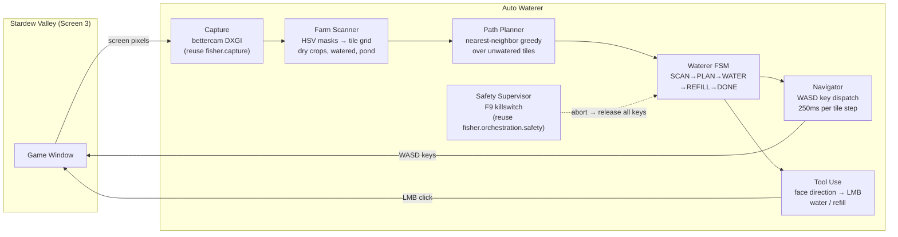
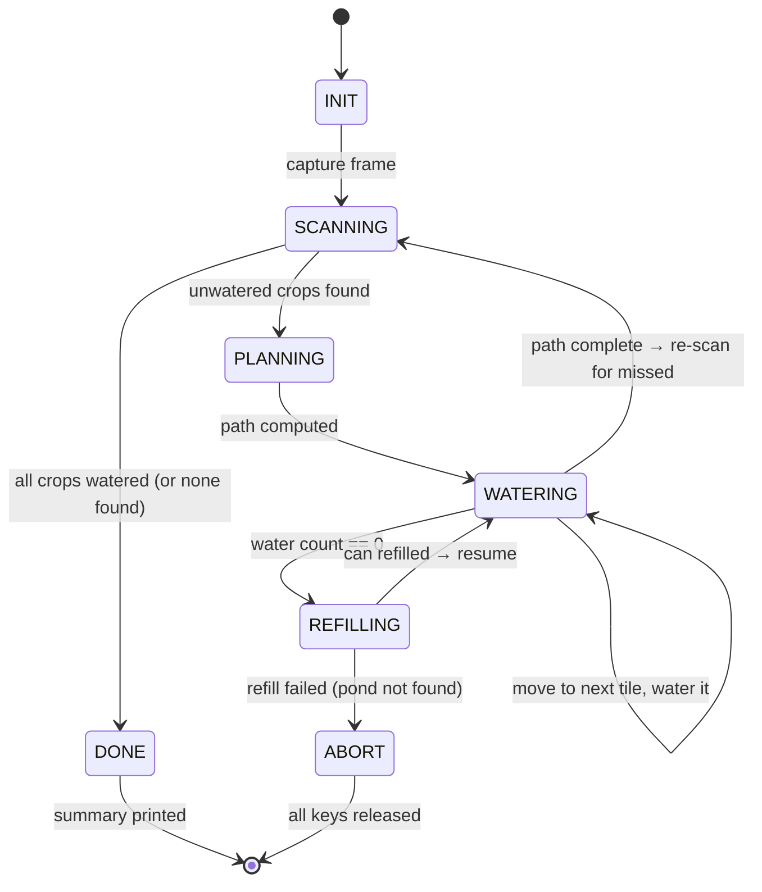

# Auto Waterer — Autonomous Crop Watering for Stardew Valley

| | |
|---|---|
| **Status** | v0 — planning (implementation pending user approval) |
| **Parent Project** | Fisher — Autonomous RL Agent for Stardew Valley |
| **Platform** | Windows 10/11, Python 3.11 |
| **Game** | Stardew Valley 1.6.x, vanilla, single-player, borderless-windowed 1920×1080, UI zoom 100% |
| **Reused Stack** | bettercam · OpenCV · pydirectinput · pywin32 · keyboard · Rich |
| **New Dependencies** | None — pure scripted automation using existing Fisher infrastructure |

---

## 0. Executive Summary

Build a background assistant (`fisher --water`) that automatically waters all unwatered planted crops visible on screen, refills the watering can from a nearby pond when empty, then stops. The player equips the watering can and stands near their crops; the bot handles the rest.

Unlike the Fisher (which uses RL to control a reactive minigame), the Waterer is a **deterministic scripted automation**: computer vision detects crop tiles → pathfinder plans an efficient walk → WASD navigation moves the player tile-by-tile → left-click uses the watering can → repeat until done or empty → walk to pond to refill → continue.

**Success criteria:**
1. Correctly identifies unwatered crop tiles vs watered tiles vs empty soil vs non-farm terrain.
2. Waters all visible unwatered crops in a single run with ≤ 5% miss rate.
3. Navigates to the pond (right side of farm) and refills when the watering can is depleted.
4. F9 killswitch releases all held keys/mouse within < 200 ms.
5. Zero input leakage — all WASD/clicks only dispatch when Stardew Valley is the foreground window.

---

## 1. Goals, Non-Goals, Constraints

**Goals**
- One-command crop watering: `fisher --water` from an Admin PowerShell while game is on Screen 3.
- CV-based detection of tilled soil, planted crops, watered vs dry state, and pond water.
- Tile-grid-aligned WASD navigation (Stardew uses a strict 64 px tile grid at 1080p/100% zoom).
- Automatic watering can refill at the pond visible in the right side of the farm.
- Reuse Fisher's capture, input, safety, config, and CLI infrastructure.

**Non-goals**
- No pathfinding beyond visible screen (no map scrolling, no entering buildings).
- No tool switching (user must have watering can equipped before starting).
- No crop planting, harvesting, or seed management.
- No support for sprinklers (if you have sprinklers, you don't need this bot).
- No RL / neural network — this is pure scripted CV + automation.

**Constraints**
- Player must stand near crops with watering can in hand before starting.
- Game must be on Screen 3 (`\\.\DISPLAY6`), borderless windowed 1080p, 100% UI zoom.
- Terminal must run as Administrator (same Windows UIPI requirement as Fisher).
- Pond must be reachable by walking in a cardinal direction from the crop area.

---

## 2. Domain Model — Stardew Valley Farm Tiles

### 2.1 Tile grid geometry

Stardew Valley uses a fixed **64×64 pixel tile grid** at 1920×1080 with 100% UI zoom. The camera is locked to the player character, who is always centered on screen.

```
Screen (1920 × 1080)          Tile Grid (30 × ~16 visible tiles)
┌──────────────────────┐      ┌──┬──┬──┬──┬──┬──┬──┬──┐
│                      │      │  │  │  │  │  │  │  │  │
│    ┌──┐              │      │  │🌱│🌱│🌱│  │  │💧│  │
│    │🧑│ ← player     │  →   │  │🌱│🧑│🌱│  │  │💧│  │
│    └──┘  always at   │      │  │🌱│🌱│🌱│  │  │💧│  │
│          center      │      │  │  │  │  │  │  │💧│  │
│                      │      └──┴──┴──┴──┴──┴──┴──┴──┘
└──────────────────────┘       crops        pond →
```

- **Player center**: approximately `(960, 540)` in screen pixels (center of 1920×1080, adjusted for HUD)
- **Visible tiles**: ~30 columns × ~16 rows at 64 px/tile
- **Tile origin**: player tile = `(0, 0)` in relative grid coordinates

### 2.2 Soil & crop visual states

| State | Visual Appearance | HSV Signature | Action |
|---|---|---|---|
| **Untilled ground** | Sandy/dirt colored | H: 20-40, S: 40-100, V: 140-200 | Skip |
| **Tilled soil (dry)** | Darker brown, grid lines visible | H: 10-25, S: 60-140, V: 80-140 | Water if crop present |
| **Tilled soil (watered)** | Very dark brown/black | H: 10-30, S: 40-100, V: 30-70 | Skip (already watered) |
| **Planted crop** | Green sprite above tilled soil | H: 35-85, S: 80-255, V: 60-200 | Target for watering |
| **Pond water** | Blue/teal surface | H: 90-130, S: 80-255, V: 80-200 | Refill target |

### 2.3 Watering can mechanics

- **Use action**: Left-click while facing a tile → waters that tile.
- **Facing**: The player faces the last direction they moved (WASD). The tool acts on the tile in the faced direction.
- **Capacity**: Basic = 40, Copper = 55, Steel = 70, Gold = 85, Iridium = 100 uses.
- **Refill**: Stand adjacent to water → use can (left-click) while facing the water → refills to full. Takes ~0.5–1.0 s animation.
- **Empty indicator**: When empty, the watering action produces a different sound and no water splash. CV can detect the absence of the darkening effect on soil.

---

## 3. System Architecture

### 3.1 Data flow



### 3.2 State machine



### 3.3 State table

| State | Entry Action | Exit Condition | Timeout / Failure |
|---|---|---|---|
| `INIT` | Load config, start capture, verify game foreground, check can equipped | Ready → `SCANNING` | 5 s → ABORT |
| `SCANNING` | Capture frame → run `FarmScanner` → classify tiles | Unwatered found → `PLANNING`; None → `DONE` | 3 s → ABORT |
| `PLANNING` | Build nearest-neighbor path from player through unwatered tiles | Path ready → `WATERING` | 1 s → ABORT |
| `WATERING` | For each tile: navigate (WASD) → face tile → LMB click → decrement counter | Path done → `SCANNING`; Counter 0 → `REFILLING` | Stuck > 5 s → ABORT |
| `REFILLING` | Walk toward pond direction → face water → LMB (use can) → wait 1 s | Refilled → `WATERING` | Max walk exceeded → ABORT |
| `DONE` | Print summary (tiles watered, refills, duration) | — | Terminal |
| `ABORT` | Release all WASD keys + LMB, print state | — | Terminal |

### 3.4 Watering action sequence (per tile)

```python
# Pseudocode for watering a single tile
def water_tile(target: TileCoord, current: TileCoord):
    # 1. Compute direction from current to target
    dx, dy = target.col - current.col, target.row - current.row
    
    # 2. Navigate: one WASD press per tile (may need multiple steps)
    for step in path_between(current, target):
        key = direction_to_key(step)  # 'w', 'a', 's', 'd'
        actuator.key_press(key, duration=0.25)  # 250ms = 1 tile walk
        time.sleep(0.05)  # settle
    
    # 3. Face the tile (tap direction key briefly if already adjacent)
    # In Stardew, the player waters the tile they're standing on,
    # or the tile they're facing (depends on tool range).
    # Basic can: waters the tile the player is facing (1 tile ahead).
    # So we navigate TO the tile adjacent to the target, then face it.
    
    # 4. Use watering can
    actuator.click(button="left", duration=0.15)
    time.sleep(0.3)  # wait for watering animation
    
    # 5. Decrement water counter
    water_remaining -= 1
```

> **Important nuance**: The basic watering can waters the tile the player is **facing**, not the tile they're standing on. So the navigator must walk to an **adjacent** tile and face toward the target. For efficiency, we walk through rows and water tiles in the faced direction as we pass by them.

### 3.5 Efficient row-scan watering pattern

Rather than nearest-neighbor on individual tiles, the optimal pattern for rectangular crop patches is a **serpentine row scan** (boustrophedon):

```
→ → → → → →
            ↓
← ← ← ← ← ←
↓
→ → → → → →
```

Walk along a row, watering each tile to the side as you pass:
1. Walk right along row N, watering tile to the south (face down, click)
2. Step down at the end
3. Walk left along row N+1, watering tile to the south (face down, click)

This minimizes total WASD key presses and is the pattern real players use.

---

## 4. Component Design

### 4.1 Crop & tile detection (`src/fisher/extraction/crops.py`)

```python
class FarmTileClassifier:
    """Classify tiles in a captured frame into soil states and features."""
    
    def classify_frame(self, frame: np.ndarray) -> dict[TileCoord, TileState]:
        """Analyze a full-screen frame and return per-tile classifications.
        
        TileState enum: UNTILLED, DRY_EMPTY, DRY_PLANTED, WATERED, WATER_BODY, OTHER
        
        Pipeline:
        1. Convert to HSV
        2. Apply masks for each soil state
        3. Quantize to 64px tile grid
        4. For each tilled tile, check for green crop sprite presence
        5. Return classified tile map
        """
```

Key detection logic:

**Dry tilled soil** (needs watering):
```python
# Brown tilled soil mask — distinctly darker than sandy ground
lower_dry = np.array([10, 60, 80])
upper_dry = np.array([25, 140, 140])
mask_dry = cv2.inRange(hsv, lower_dry, upper_dry)
```

**Watered soil** (skip):
```python
# Very dark — already watered
lower_wet = np.array([10, 40, 30])
upper_wet = np.array([30, 100, 70])
mask_wet = cv2.inRange(hsv, lower_wet, upper_wet)
```

**Crop sprite** (green pixels above tilled soil):
```python
# Green plant sprites
lower_green = np.array([35, 80, 60])
upper_green = np.array([85, 255, 200])
mask_crop = cv2.inRange(hsv, lower_green, upper_green)
```

**Pond water** (refill target):
```python
# Blue water body
lower_blue = np.array([90, 80, 80])
upper_blue = np.array([130, 255, 200])
mask_water = cv2.inRange(hsv, lower_blue, upper_blue)
```

Tile classification: for each 64×64 tile region, compute the percentage of pixels matching each mask. A tile is classified by whichever state exceeds its threshold (e.g., > 30% dry soil pixels + > 10% green crop pixels = `DRY_PLANTED`).

### 4.2 Tile grid math (`src/fisher/extraction/tiles.py`)

```python
from typing import NamedTuple

class TileCoord(NamedTuple):
    """Grid-relative tile position. Player = (0, 0)."""
    row: int  # positive = down (south)
    col: int  # positive = right (east)

def screen_to_tile(px_x: int, px_y: int, 
                   player_center: tuple[int, int] = (960, 540),
                   tile_size: int = 64) -> TileCoord:
    """Convert screen pixel to player-relative tile coordinate."""
    col = round((px_x - player_center[0]) / tile_size)
    row = round((px_y - player_center[1]) / tile_size)
    return TileCoord(row=row, col=col)

def tile_to_screen(tile: TileCoord,
                   player_center: tuple[int, int] = (960, 540),
                   tile_size: int = 64) -> tuple[int, int]:
    """Convert tile coordinate to screen pixel center."""
    px_x = player_center[0] + tile.col * tile_size
    px_y = player_center[1] + tile.row * tile_size
    return (px_x, px_y)
```

### 4.3 Path planner (`src/fisher/waterer/pathfinder.py`)

Two strategies available:

**Strategy A: Nearest-neighbor greedy** (general case)
```python
def plan_greedy(tiles: list[TileCoord], start: TileCoord) -> list[TileCoord]:
    """Visit tiles in nearest-first order (Manhattan distance)."""
    remaining = list(tiles)
    path = []
    current = start
    while remaining:
        nearest = min(remaining, key=lambda t: abs(t.row - current.row) + abs(t.col - current.col))
        path.append(nearest)
        remaining.remove(nearest)
        current = nearest
    return path
```

**Strategy B: Serpentine row scan** (optimal for rectangular patches)
```python
def plan_serpentine(tiles: list[TileCoord]) -> list[TileCoord]:
    """Sort tiles into boustrophedon (serpentine) row order."""
    by_row = {}
    for t in tiles:
        by_row.setdefault(t.row, []).append(t)
    
    path = []
    for i, row in enumerate(sorted(by_row.keys())):
        row_tiles = sorted(by_row[row], key=lambda t: t.col, reverse=(i % 2 == 1))
        path.extend(row_tiles)
    return path
```

The planner auto-selects serpentine when tiles form a roughly rectangular patch (aspect ratio < 3:1, fill ratio > 60%), otherwise falls back to greedy.

### 4.4 Navigator (`src/fisher/waterer/navigator.py`)

```python
class TileNavigator:
    """Move the player tile-by-tile using WASD key presses."""
    
    DIRECTION_KEYS = {
        ( 0,  1): 'd',  # east
        ( 0, -1): 'a',  # west  
        ( 1,  0): 's',  # south
        (-1,  0): 'w',  # north
    }
    
    def __init__(self, actuator: Actuator, tile_walk_ms: int = 250):
        self.actuator = actuator
        self.tile_walk_s = tile_walk_ms / 1000.0
        self.current_pos = TileCoord(0, 0)
        self.facing = 's'  # default facing south
    
    def move_one_tile(self, direction: tuple[int, int]) -> None:
        """Press WASD key for one tile duration."""
        key = self.DIRECTION_KEYS[direction]
        self.actuator.key_press(key, duration=self.tile_walk_s)
        self.facing = key
        dr, dc = direction
        self.current_pos = TileCoord(
            self.current_pos.row + dr,
            self.current_pos.col + dc,
        )
        time.sleep(0.05)  # settle after movement
    
    def navigate_to(self, target: TileCoord) -> None:
        """Navigate from current position to target tile."""
        while self.current_pos != target:
            dr = target.row - self.current_pos.row
            dc = target.col - self.current_pos.col
            # Move one axis at a time (prefer horizontal first)
            if dc != 0:
                step = (0, 1 if dc > 0 else -1)
            else:
                step = (1 if dr > 0 else -1, 0)
            self.move_one_tile(step)
    
    def face_direction(self, key: str) -> None:
        """Face a direction without moving (brief tap)."""
        if self.facing != key:
            self.actuator.key_press(key, duration=0.05)
            self.facing = key
            time.sleep(0.05)
```

### 4.5 Waterer assistant (`src/fisher/waterer/assistant.py`)

Mirrors the `FishingAssistant` pattern:

```python
class WateringAssistant:
    """Autonomous crop watering assistant.
    
    Usage:
        assistant = WateringAssistant.from_config(config)
        assistant.run()  # Blocks until done or F9
    """
    
    @classmethod
    def from_config(cls, config=None, mock_mode=False, preview=False, 
                    capacity_override=None) -> "WateringAssistant":
        """Factory: build from config + shared Fisher infrastructure."""
    
    def run(self) -> WateringStats:
        """Main blocking loop: SCAN → PLAN → WATER → REFILL → DONE."""
```

---

## 5. Input Layer Extension

### 5.1 Changes to `Actuator` base class

```python
# New abstract methods added to fisher.input.base.Actuator

def key_down(self, key: str) -> None:
    """Hold a keyboard key down."""
    pass

def key_up(self, key: str) -> None:
    """Release a keyboard key."""
    pass

def key_press(self, key: str, duration: float = 0.05) -> None:
    """Press and release a key with specified hold duration."""
    self.key_down(key)
    time.sleep(duration)
    self.key_up(key)

def key_tap(self, key: str) -> None:
    """Instant key press and release."""
    self.key_press(key, duration=0.02)

def release_all_keys(self) -> None:
    """Release all currently held keys (safety)."""
    pass
```

### 5.2 `DirectInputActuator` implementation

```python
# New methods in fisher.input.direct_input.DirectInputActuator

def __init__(self, ...):
    ...
    self._held_keys: set[str] = set()  # track held keys for safety release

def key_down(self, key: str) -> None:
    if self.strict_foreground and not self.is_game_foreground():
        return
    pydirectinput.keyDown(key)
    self._held_keys.add(key)

def key_up(self, key: str) -> None:
    pydirectinput.keyUp(key)
    self._held_keys.discard(key)

def release_all_keys(self) -> None:
    for key in list(self._held_keys):
        try:
            pydirectinput.keyUp(key)
        except Exception:
            pass
    self._held_keys.clear()

def emergency_release(self) -> None:
    # Existing: release mouse
    super().emergency_release()  
    # New: also release all held keys
    self.release_all_keys()
```

---

## 6. Configuration

### `configs/default.yaml` — new `waterer:` section

```yaml
waterer:
  tile_size_px: 64                # Tile grid size at 100% UI zoom 1080p
  player_center: [960, 540]       # Player center on screen (camera-locked)
  water_capacity: 40              # Watering can uses (basic=40, copper=55, steel=70, gold=85, iridium=100)
  tile_walk_ms: 250               # WASD key hold per tile movement
  watering_click_ms: 150          # LMB hold for watering action
  refill_click_ms: 500            # LMB hold for refilling at pond
  watering_settle_ms: 300         # Wait after watering before next action
  max_scan_passes: 3              # Re-scan passes before declaring done
  scan_settle_ms: 500             # Wait after all movement before scanning
  pond_direction: "right"         # Cardinal direction to walk for refill (right/left/up/down)
  pond_max_tiles: 15              # Max tiles to walk toward pond before abort
  path_strategy: "auto"           # auto | serpentine | greedy
  detection_thresholds:
    dry_soil_pct: 30              # % of tile pixels matching dry soil HSV
    watered_soil_pct: 25          # % matching watered soil HSV
    crop_sprite_pct: 10           # % matching green crop HSV
    water_body_pct: 40            # % matching blue water HSV
```

---

## 7. CLI Integration

### New arguments in `src/fisher/cli.py`

```python
parser.add_argument("--water", action="store_true",
    help="Start the auto watering assistant (waters visible crops, refills at pond)")
parser.add_argument("--capacity", type=int, default=None,
    help="Override watering can capacity (basic=40, copper=55, steel=70, gold=85, iridium=100)")
```

### Commands

```bash
# Primary: auto water all visible crops
fisher --water

# With CV preview overlay
fisher --water --preview

# Override can capacity (e.g. copper can)
fisher --water --capacity 55

# Mock dry run (no game needed)
fisher --water --mock

# Safety: F9 to stop at any time
```

---

## 8. File Manifest

| Action | File Path | Purpose |
|---|---|---|
| **[NEW]** | `src/fisher/extraction/crops.py` | `FarmTileClassifier` — HSV-based tile state detection (dry/watered/planted/water) |
| **[NEW]** | `src/fisher/extraction/tiles.py` | `TileCoord`, screen↔grid coordinate conversion utilities |
| **[NEW]** | `src/fisher/waterer/__init__.py` | Package init, exports `WateringAssistant` |
| **[NEW]** | `src/fisher/waterer/assistant.py` | `WateringAssistant` — main FSM orchestrator |
| **[NEW]** | `src/fisher/waterer/detector.py` | `FarmScanner` — composes CV extractors into tile scan results |
| **[NEW]** | `src/fisher/waterer/pathfinder.py` | Nearest-neighbor + serpentine path planners |
| **[NEW]** | `src/fisher/waterer/navigator.py` | `TileNavigator` — WASD tile-by-tile movement controller |
| **[NEW]** | `tests/test_waterer.py` | 11 unit tests (detection, pathfinding, navigation, FSM, safety) |
| **[MODIFY]** | `src/fisher/input/base.py` | Add `key_down`, `key_up`, `key_press`, `key_tap`, `release_all_keys` to `Actuator` |
| **[MODIFY]** | `src/fisher/input/direct_input.py` | Implement keyboard methods + held-key tracking for safety release |
| **[MODIFY]** | `src/fisher/input/mock_actuator.py` | Mock keyboard implementations logging to `self.history` |
| **[MODIFY]** | `configs/default.yaml` | Add `waterer:` config section |
| **[MODIFY]** | `src/fisher/cli.py` | Add `--water` and `--capacity` CLI arguments |

---

## 9. Test Plan

### `tests/test_waterer.py` — 11 tests

| # | Test | What It Validates |
|---|---|---|
| 1 | `test_tile_coord_roundtrip` | `screen_to_tile` ↔ `tile_to_screen` inverse correctness |
| 2 | `test_tile_grid_player_center` | Player pixel `(960, 540)` maps to `TileCoord(0, 0)` |
| 3 | `test_dry_soil_detection` | Synthetic brown tile classified as `DRY_EMPTY` or `DRY_PLANTED` |
| 4 | `test_watered_soil_detection` | Synthetic dark tile classified as `WATERED` (skip) |
| 5 | `test_crop_sprite_detection` | Tile with green pixels above soil → `DRY_PLANTED` |
| 6 | `test_water_body_detection` | Blue tile region classified as `WATER_BODY` |
| 7 | `test_pathfinder_greedy` | Greedy path visits all tiles, starts from player |
| 8 | `test_pathfinder_serpentine` | Serpentine produces boustrophedon row ordering |
| 9 | `test_navigator_wasd` | `TileNavigator` dispatches correct WASD keys (mock actuator) |
| 10 | `test_watering_fsm_full_cycle` | SCAN→PLAN→WATER→DONE with mock drivers |
| 11 | `test_refill_and_resume` | WATER→REFILL→WATER when capacity hits 0 |
| 12 | `test_killswitch_releases_keys` | F9 during watering → all WASD + LMB released |
| 13 | `test_keyboard_extension` | `key_down`, `key_up`, `key_press` on mock actuator |

### Verification commands

```bash
# Full test suite (Fisher + Waterer, must remain green)
pytest -v

# Waterer tests only
pytest -v tests/test_waterer.py

# Mock dry run
fisher --water --mock
```

---

## 10. Open Design Questions

These should be resolved before or during implementation:

| # | Question | Default Assumption | Impact |
|---|---|---|---|
| Q1 | **Tile size**: Is it exactly 64 px at 1080p/100% zoom? | Yes, 64 px | Core grid math — if wrong, all tile detection breaks |
| Q2 | **Watering can level**: What upgrade does the user have? | Basic (40 uses) | Refill frequency via `--capacity` override |
| Q3 | **Tool facing**: Does the basic can water the tile in front or below? | Tile in front (faced direction) | Determines whether navigator walks *to* or *adjacent to* target |
| Q4 | **Crop detection scope**: Water only tiles with green sprites, or all dry tilled soil? | Only tiles with crops (green sprites) | Prevents wasting water on empty tilled tiles |
| Q5 | **Pond location**: Always to the right? | Yes (per screenshot) | `pond_direction: "right"` in config |
| Q6 | **Player center offset**: Is `(960, 540)` exact or offset by HUD/toolbar? | `(960, 540)` — toolbar is below the game viewport | Tile alignment accuracy |
| Q7 | **Movement timing**: Is 250ms per tile correct for walking speed? | Yes at normal speed, no buffs | If player has speed buff, tiles are traversed faster |

---

## 11. Risks & Mitigations

| Risk | Probability | Impact | Mitigation |
|---|---|---|---|
| HSV thresholds wrong for weather/time-of-day | Medium | Missed/misclassified tiles | Calibration with real screenshots; configurable thresholds |
| Tile size not exactly 64 px | Low | Grid misalignment | Auto-calibration from tilled soil grid lines |
| Player position drift (cumulative movement error) | Medium | Watering wrong tiles | Periodic re-scan after every N tiles to recalibrate position |
| Watering can empty but no refill feedback | Low | Wastes time attempting to water | Count uses; if soil doesn't darken after click, trigger refill |
| Stuck on obstacle (fence, rock, NPC) | Medium | Navigator loops | Stuck detection: if position unchanged after 3 attempts → skip tile |
| Night falls during operation | Low | Player passes out | Optional: check clock HUD (reuse Fisher lifecycle detector) |

---

## 12. Implementation Phases & Milestones

> Effort estimates assume one engineer, part-time. `- [ ]` checkboxes are the working task list; update as items complete.

### Phase 0 — Input Extension & Foundation (0.5 d)

Extend the existing Fisher input layer with keyboard support and add the waterer config section. This is pure infrastructure — no game interaction, fully CI-testable.

- [ ] `src/fisher/input/base.py`: Add abstract `key_down`, `key_up`, `key_press`, `key_tap`, `release_all_keys` methods to `Actuator` base class
- [ ] `src/fisher/input/direct_input.py`: Implement keyboard methods via `pydirectinput` with held-key tracking (`_held_keys: set[str]`) and foreground guard; extend `emergency_release()` to release all held keys
- [ ] `src/fisher/input/mock_actuator.py`: Mock keyboard implementations logging key events to `self.history` for test assertions
- [ ] `configs/default.yaml`: Add `waterer:` configuration section (§6) with all tile, timing, detection, and path parameters
- [ ] Unit test: `test_keyboard_extension` — verify `key_down`, `key_up`, `key_press` dispatch correctly on mock actuator; verify `release_all_keys` clears all held keys

**Files touched:**

| Action | File Path | Purpose |
|---|---|---|
| **[MODIFY]** | `src/fisher/input/base.py` | Add keyboard abstract methods to `Actuator` |
| **[MODIFY]** | `src/fisher/input/direct_input.py` | Implement keyboard + held-key safety tracking |
| **[MODIFY]** | `src/fisher/input/mock_actuator.py` | Mock keyboard for headless testing |
| **[MODIFY]** | `configs/default.yaml` | Add `waterer:` config section |

**Done when:** `pytest -v` passes with zero regressions on existing Fisher tests; mock actuator correctly logs `key_down`/`key_up` sequences; `release_all_keys` verified to clear all held state.

---

### Phase 1 — CV Tile Detection & Grid Math (1.5 d)

Build the computer vision pipeline that classifies every visible 64×64 tile into one of: `UNTILLED`, `DRY_EMPTY`, `DRY_PLANTED`, `WATERED`, `WATER_BODY`, `OTHER`. This is the perception backbone — must be solid before navigation or automation.

- [ ] `src/fisher/extraction/tiles.py`: `TileCoord` named tuple, `screen_to_tile` / `tile_to_screen` coordinate conversion, tile grid constants
- [ ] `src/fisher/extraction/crops.py`: `FarmTileClassifier` — HSV masks for dry soil, watered soil, crop sprites, pond water; per-tile classification via pixel-percentage thresholds (configurable from `waterer.detection_thresholds`)
- [ ] `src/fisher/waterer/__init__.py`: Package init, public exports
- [ ] `src/fisher/waterer/detector.py`: `FarmScanner` — composes `FarmTileClassifier` over a full captured frame; returns `dict[TileCoord, TileState]` tile map; filters player-center tile; identifies pond-adjacent tiles
- [ ] Unit tests:
  - `test_tile_coord_roundtrip` — `screen_to_tile` ↔ `tile_to_screen` inverse correctness
  - `test_tile_grid_player_center` — pixel `(960, 540)` maps to `TileCoord(0, 0)`
  - `test_dry_soil_detection` — synthetic brown tile classified as `DRY_EMPTY` or `DRY_PLANTED`
  - `test_watered_soil_detection` — synthetic dark tile classified as `WATERED`
  - `test_crop_sprite_detection` — green pixels above soil → `DRY_PLANTED`
  - `test_water_body_detection` — blue tile region → `WATER_BODY`
- [ ] *(Optional)* Real screenshot validation with captured farm frame from Screen 3

**Files touched:**

| Action | File Path | Purpose |
|---|---|---|
| **[NEW]** | `src/fisher/extraction/tiles.py` | `TileCoord`, screen↔grid coordinate math |
| **[NEW]** | `src/fisher/extraction/crops.py` | `FarmTileClassifier` — HSV tile state detection |
| **[NEW]** | `src/fisher/waterer/__init__.py` | Package init |
| **[NEW]** | `src/fisher/waterer/detector.py` | `FarmScanner` — full-frame tile scan |
| **[MODIFY]** | `tests/test_waterer.py` | 6 CV & grid math tests |

**Done when:** All 6 detection/grid tests pass; `FarmTileClassifier` correctly separates dry soil, watered soil, crops, and water on synthetic tile images with configurable thresholds.

---

### Phase 2 — Navigation & Path Planning (1.0 d)

Build the WASD tile-by-tile navigator and the path planner (greedy + serpentine strategies). These are pure logic components testable entirely with mock actuators.

- [ ] `src/fisher/waterer/pathfinder.py`: `plan_greedy` (nearest-neighbor Manhattan) and `plan_serpentine` (boustrophedon row scan); auto-selection heuristic (rectangular patch → serpentine, irregular → greedy)
- [ ] `src/fisher/waterer/navigator.py`: `TileNavigator` — WASD key dispatch via actuator; `move_one_tile`, `navigate_to`, `face_direction`; tracks `current_pos` and `facing` state; configurable `tile_walk_ms`
- [ ] Unit tests:
  - `test_pathfinder_greedy` — visits all tiles, starts from player, no duplicates
  - `test_pathfinder_serpentine` — produces correct boustrophedon row ordering
  - `test_navigator_wasd` — `TileNavigator` dispatches correct WASD key sequence (mock actuator verification)

**Files touched:**

| Action | File Path | Purpose |
|---|---|---|
| **[NEW]** | `src/fisher/waterer/pathfinder.py` | Greedy + serpentine path planners |
| **[NEW]** | `src/fisher/waterer/navigator.py` | WASD tile-by-tile movement controller |
| **[MODIFY]** | `tests/test_waterer.py` | 3 pathfinding & navigation tests |

**Done when:** All 3 path/nav tests pass; serpentine correctly reverses alternating rows; navigator produces minimal WASD sequences for any (row, col) delta.

---

### Phase 3 — FSM Assistant, CLI & Integration (1.5 d)

Wire everything together into the `WateringAssistant` FSM, integrate with the CLI, and complete the full test suite. This phase delivers the user-facing `fisher --water` command.

- [ ] `src/fisher/waterer/assistant.py`: `WateringAssistant` — main FSM orchestrator (INIT → SCANNING → PLANNING → WATERING → REFILLING → DONE / ABORT); `from_config()` factory; `run()` blocking loop; water counter tracking; re-scan after path completion; summary stats on exit
- [ ] Refill logic: walk toward `pond_direction` up to `pond_max_tiles`; face water tile; LMB click with `refill_click_ms` hold; wait for refill animation; detect success (soil-darkening on next water action or scan re-check)
- [ ] Safety: reuse Fisher `SafetySupervisor` for F9 killswitch; `release_all_keys()` on abort; foreground guard on every WASD/click dispatch
- [ ] `src/fisher/cli.py`: Add `--water` and `--capacity` arguments; dispatch to `WateringAssistant.from_config()` with `mock_mode`, `preview`, and `capacity_override` propagation
- [ ] `--preview` mode: OpenCV overlay showing tile grid classification (color-coded: red = dry+crop, dark = watered, blue = water, gray = other) and current path
- [ ] Unit tests:
  - `test_watering_fsm_full_cycle` — SCAN → PLAN → WATER → DONE with mock drivers
  - `test_refill_and_resume` — WATER → REFILL → WATER when capacity hits 0
  - `test_killswitch_releases_keys` — F9 during watering → all WASD + LMB released within < 200 ms
- [ ] Integration: `fisher --water --mock` dry run passes end-to-end with mock capture + mock actuator

**Files touched:**

| Action | File Path | Purpose |
|---|---|---|
| **[NEW]** | `src/fisher/waterer/assistant.py` | `WateringAssistant` FSM orchestrator |
| **[MODIFY]** | `src/fisher/cli.py` | `--water` and `--capacity` CLI args |
| **[MODIFY]** | `tests/test_waterer.py` | 3 FSM + safety tests |

**Done when:** `pytest -v` passes with all 13 waterer tests + zero regressions on existing Fisher tests (69+ total); `fisher --water --mock` completes a full SCAN → PLAN → WATER → DONE cycle with mock drivers; F9 killswitch releases all keys within < 200 ms.

---

### Milestone Summary

| Phase | Duration | Exit Gate | Cumulative | Status |
|---|---|---|---|---|
| 0 Input Extension & Foundation | 0.5 d | Keyboard methods work on mock; config loads; zero Fisher regressions | 0.5 d | Pending |
| 1 CV Tile Detection & Grid Math | 1.5 d | 6 detection tests pass; HSV masks classify synthetic tiles correctly | 2.0 d | Pending |
| 2 Navigation & Path Planning | 1.0 d | 3 nav/path tests pass; serpentine + greedy correct; mock WASD sequences verified | 3.0 d | Pending |
| 3 FSM Assistant, CLI & Integration | 1.5 d | 13 waterer tests + 69 Fisher tests green; `fisher --water --mock` end-to-end; F9 < 200 ms | 4.5 d | Pending |

### Verification Commands

```bash
# Full test suite (Fisher + Waterer, must remain green)
pytest -v

# Waterer tests only
pytest -v tests/test_waterer.py

# Mock dry run (no game needed)
fisher --water --mock

# With CV preview overlay (requires game on Screen 3)
fisher --water --preview

# Override can capacity (e.g. copper can = 55)
fisher --water --capacity 55
```
